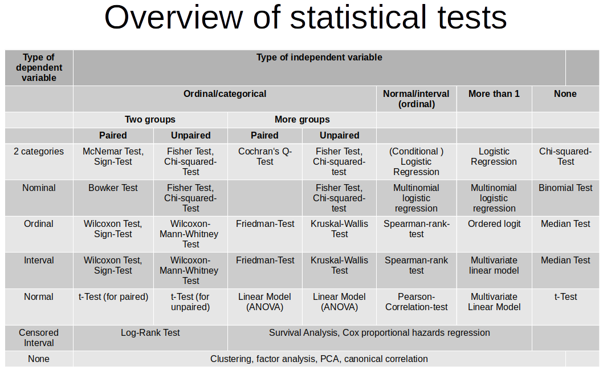

--- 
title: "Metody przetwarzania i analizy danych w R"
author: "Łukasz Wawrowski"
date: ""
site: bookdown::bookdown_site
output: bookdown::gitbook
documentclass: book
github-repo: lwawrowski/analiza-danych-R
description: "Materiały dydaktyczne do kursu Metody przetwarzania i analizy danych w R."
---

# Literatura {-}

Podstawowa:

- [Garret Grolemund, Hadley Wickham - Język R](https://helion.pl/ksiazki/jezyk-r-kompletny-zestaw-narzedzi-dla-analitykow-danych-hadley-wickham-garrett-grolemund,jezrko.htm)
- [Marek Gągolewski - Programowanie w języku R. Analiza danych, obliczenia, symulacje](http://www.gagolewski.com/publications/programowanier/)

Dodatkowa:

- [R for Data Science](http://r4ds.had.co.nz/)
- [Hands-On Machine Learning with R](https://bradleyboehmke.github.io/HOML/)
- [Introduction to Data Science](https://ubc-dsci.github.io/introduction-to-datascience/)
- [Applied Statistics with R](https://daviddalpiaz.github.io/appliedstats/)
- [Data Science Live Book](https://livebook.datascienceheroes.com/)

**[Skrypty z zajęć](https://github.com/lwawrowski/cdv_bigdata)**

<!--chapter:end:index.Rmd-->

# Analiza opisowa 

## Wprowadzenie

[Prezentacja](presentations/01_eda.html)

## Eksploracyjna analiza danych

Explanatory Data Analysis (EDA) polega na opisie i wizualizacji danch bez zakładania hipotez badawczych. W R dostępnych jest wiele pakietów, które wspierają ten proces - [The Landscape of R Packages for Automated Exploratory Data Analysis](https://journal.r-project.org/archive/2019/RJ-2019-033/index.html).

Najczęściej pobieramym pakietem jest [summarytools](https://cran.r-project.org/web/packages/summarytools/vignettes/Introduction.html) z następującymi funkcjami:

- `view(dfSummary(zbior))` - wyświetla podsumowanie zawierające kilka statystyk opisowych, częstości, histogram i braki danych
- `freq(zbior$zmienna)` - wyświetla tabelę częstości
- `descr(zbior)` - wyświetla zestaw 15 statystyk opisowych

Poniżej znajduje się krótki opis tych 15 miar:

- średnia (mean) - przeciętna wartość cechy
- odchylenie standardowe (std. dev) - o ile wartości cechy odchylają się średnio od średniej
- minimum (min) - minimalna wartość cechy
- kwartyl pierwszy (Q1) - 25% obserwacji ma wartości poniżej Q1, a 75% obserwacji powyżej
- mediana (median) - wartość środkowa, 50% obserwacji ma wartości poniżej Q1, a 50% obserwacji powyżej
- kwartyl trzeci (Q3) - 75% obserwacji ma wartości poniżej Q3, a 25% obserwacji powyżej
- maksimum (max) - maksymalna wartość cechy
- odchylenie medianowe (MAD) - mediana odchyleń od mediany
- rozstęp międzykwartylowy (IQR) - różnica pomiędzy trzecim i pierwszym kwartylem
- współczynnik zmienności (CV) - udział odchylenia standardowego w średniej wartości cechy (w %)
- skośność (skewness) - asymetria rozkładu cechy, $< 0$ - lewostronna, $> 0$ - prawostronna, $= 0$ - symetryczny
- błąd standardowy skośności (se.skewness)
- kurtoza (kurtosis) - skupienie wartości wokół średniej, $< 0$ - słabe, $> 0$ - silne, $= 0$ - normalne
- liczba obserwacji bez braków danych (N.Valid)
- odsetek obserwacji bez braków danych (Pct.Valid)


<!--chapter:end:01-eda.Rmd-->

# Testowanie hipotez 

[Prezentacja - raporty](presentations/02_raporty.html)

[Prezentacja - testy](presentations/03_testy.html)

## Wprowadzenie

Do rozwiązania wybranych zagadnień analizy statystycznej wystarczą metody weryfikacji hipotez statystycznych. Taki proces można przedstawić w następujących krokach:

1. Sformułowanie dwóch wykluczających się hipotez - zerowej $H_0$ oraz alternatywnej $H_1$
2. Wybór odpowiedniego testu statystycznego
3. Określenie dopuszczalnego prawdopodobieństwo popełnienia błędu I rodzaju (czyli poziomu istotności $\alpha$) 
4. Podjęcie decyzji

Wymienione powyżej nowe pojęcia zostaną wyjaśnione poniżej.

## Hipoteza statystyczna

Przypuszczenie dotyczące własności analizowanej cechy, np. średnia w populacji jest równa 10, rozkład cechy jest normalny.

Formułuje się zawsze dwie hipotezy: hipotezę zerową ($H_0$) i hipotezę alternatywną ($H_1$). Hipoteza zerowa jest hipotezą mówiącą o równości:

$H_0: \bar{x}=10$

Z kolei hipoteza alternatywna zakłada coś przeciwnego:

$H_1: \bar{x}\neq 10$

Zamiast znaku nierówności ($\neq$) może się także pojawić znak mniejszości ($<$) lub większości ($>$).

## Poziom istotności i wartość p

Hipotezy statystyczne weryfikuje się przy określonym poziomie istotności $\alpha$, który wskazuje maksymalny poziom akceptowalnego błędu (najczęściej $\alpha=0,05$).

Większość programów statystycznych podaje w wynikach testu wartość p. Jest to najostrzejszy poziom istotności, przy którym możemy odrzucić hipotezę $H_0$. Jest to rozwiązanie bardzo popularne, ale nie pozbawione wad. Dokładny opis potencjalnych zagrożeń można znaleźć w [artykule](http://cejsh.icm.edu.pl/cejsh/element/bwmeta1.element.cejsh-e3daa053-7cf2-4eee-9192-16c48c3a7a45/c/05.pdf).

Generalnie jeśli $p < \alpha$ - odrzucamy hipotezę zerową. 

## Testy statystyczne

W zależności od tego co chcemy weryfikować należy wybrać odpowiedni test. Tabela poniżej przedstawia dosyć wyczerpującą klasyfikację testów pobraną ze [strony](https://philipppro.github.io/Statistical_tests_overview/).



## Zbiór danych 

Będziemy działać na zbiorze danych dotyczącym [pracowników przedsiębiorstwa](data/pracownicy.xlsx). Poniżej znajduje się opis cech znajdujących się w tym zbiorze,

- id - kod pracownika
- plec - płeć pracownika (0 - mężczyzna, 1 - kobieta)
- data_urodz - data urodzenia
- edukacja - wykształcenie (w latach nauki)
- kat_pracownika - grupa pracownicza (1 - specjalista, 2 - menedżer, 3 - konsultant)
- bwynagrodzenie - bieżące wynagrodzenie
- pwynagrodzenie - początkowe wynagrodzenie
- staz - staż pracy (w miesiącach)
- doswiadczenie - poprzednie zatrudnienie (w miesiącach)
- zwiazki - przynależność do związków zawodowych (0 - nie, 1 - tak)
- wiek - wiek (w latach)

```{r include=FALSE}
library(patchwork)
```


```{r message=FALSE, warning=FALSE}
library(tidyverse)
library(readxl)

pracownicy <- read_excel("data/pracownicy.xlsx")
```


## Test niezależności

Za pomocą testu niezależności $\chi^2$ (chi-kwadrat) można sprawdzić czy pomiędzy dwiema cechami jakościowymi występuje zależność. Układ hipotez jest następujący:

- $H_0:$ zmienne są niezależne,
- $H_1:$ zmienne nie są niezależne.

W programie R test niezależności można wywołać za pomocą funkcji `chisq.test()` z pakietu _stats_. Jako argument tej funkcji należy podać tablicę kontyngencji. W przypadku operowania na danych jednostkowych można ją utworzyć poprzez funkcję `table()`. Jeżeli wprowadzamy liczebności ręcznie to należy zadbać o to, żeby wprowadzony obiekt był typu `matrix`.

**Przykład**

Czy pomiędzy zmienną płeć, a zmienną przynależność do związków zawodowych istnieje zależność? 

W pierwszym kroku określamy hipotezy badawcze:

$H_0$: pomiędzy płcią a przynależnością do związków nie ma zależności

$H_1$: pomiędzy płcią a przynależnością do związków jest zależność

oraz przyjmujemy poziom istotności - weźmy standardową wartość $\alpha = 0,05$.

W pierwszej kolejności popatrzmy na tabelę krzyżową (kontyngencji) zawierającą liczebności poszczególnych kombinacji wariantów.

```{r}
table(pracownicy$plec, pracownicy$zwiazki)
```

Wartości w tej tabeli nie wskazują na liczniejszą reprezentację jednej z płci w związkach zawodowych. Zweryfikujemy zatem wskazaną hipotezę zerową z wykorzystaniem testu $\chi^2$.

```{r}
chisq.test(table(pracownicy$plec, pracownicy$zwiazki))
```

Przy poziomie istotności $\alpha = 0,05$, wartości p (0.1245) jest większa od wartości $\alpha$, zatem nie ma podstaw do odrzucenia hipotezy zerowej. Można stwierdzić, że nie ma zależności pomiędzy zmiennymi płeć i przynależność do związków zawodowych.

**Przykład**

Czy pomiędzy płcią, a grupami bieżącego wynagrodzenia zdefiniowanymi przez medianę istnieje zależność?

$H_0$: pomiędzy płcią a grupami wynagrodzenia nie ma zależności

$H_1$: pomiędzy płcią a grupami wynagrodzenia jest zależność

W pierwszej kolejności tworzymy nową cechą zamieniając cechę `bwynagrodzenie` na zmienną jakościową posiadającą dwa warianty: poniżej mediany i powyżej mediany.

```{r}
pracownicy <- pracownicy %>% 
  mutate(bwyn_mediana=cut(x = bwynagrodzenie,
                          breaks = c(min(bwynagrodzenie),
                                     median(bwynagrodzenie),
                                     max(bwynagrodzenie)),
                          include.lowest = TRUE))

table(pracownicy$plec, pracownicy$bwyn_mediana)
```

W tym przypadku wygląd tablicy krzyżowej może sugerować występowanie zależności.

```{r}
chisq.test(table(pracownicy$plec, pracownicy$bwyn_mediana))
```

Test $\chi^2$ to potwierdza - mamy podstawy do odrzucenia hipotezy zerowej na korzyść hipotezy alternatywnej - istnieje zależność pomiędzy płcią, a grupami wynagrodzenia.

## Test proporcji

Test proporcji pozwala odpowiedzieć na pytanie czy odsetki w jednej, dwóch lub więcej grupach różnią się od siebie istotnie. Dla jednej próby układ hipotez został przedstawiony poniżej:

- $H_0: p=p_0$
- $H_1: p \neq p_0$ lub $H_1: p > p_0$ lub $H_1: p < p_0$

Układ hipotez w przypadku dwóch prób jest następujący:

- $H_0: p_1=p_2$
- $H_1: p_1 \neq p_2$ lub $H_1: p_1 > p_2$ lub $H_1: p_1 < p_2$

Dla $k$ badanych prób hipotezę zerową i alternatywną można zapisać w następująco:

- $H_0: p_1=p_2=p3=...=p_k$
- $H_1: \exists \; p_i \neq p_j$

W takim przypadku hipoteza alternatywna oznacza, że co najmniej jeden odsetek różni się istotnie od pozostałych. 

Funkcja `prop.test` z pakietu _stats_ umożliwia przeprowadzanie testu proporcji w programie R. Jako argumenty należy podać wektor, który zawiera licznik badanych odsetków - `x`, oraz wektor zawierający wartości mianownika - `n`. W przypadku jednej próby należy jeszcze dodać argument `p`, którego wartość oznacza weryfikowany odsetek.

**Przykład**

Wysunięto przypuszczenie, że palacze papierosów stanowią jednakowy odsetek wśród mężczyzn i kobiet. W celu sprawdzenia tej hipotezy wylosowano 500 mężczyzn i 600 kobiet. Okazało się, że wśród mężczyzn było 200 palaczy, a wśród kobiet 250.

$H_0$: odsetek palaczy wg płci jest taki sam

$H_1$: odsetek palaczy różni się wg płci

```{r}
prop.test(x = c(200,250), n = c(500,600))
```

Przy poziomie istotności 0,05 nie ma podstaw do odrzucenia H0 - odsetek palaczy jest taki sam w grupach płci.

## Testowanie normalności - test Shapiro-Wilka

Testy parametryczne z reguły wymagają spełnienia założenia o normalności rozkładu. W celu weryfikacji tego założenia należy wykorzystać jeden z testów normalności.

W celu formalnego zweryfikowania rozkładu cechy można wykorzystać test Shapiro-Wilka. Układ hipotez z tym teście jest następujący:

- $H_0: F(x) = F_0(x)$ - rozkład cechy ma rozkład normalny
- $H_1: F(x) \neq F_0(x)$ - rozkład cechy nie ma rozkładu normalnego

W przeprowadzonych dotychczas symulacjach wykazano, że test Shapiro-Wilka ma największą moc spośród testów normalności, niemniej jego ograniczeniem jest maksymalna liczba obserwacji, która wynosi 5000^[W przypadku liczniejszych prób można wykorzystać test Kołmogorowa-Smirnova.]. 

W programie R test Shapiro-Wilka można uruchomić za pomocą funkcji `shapiro.test()` jako argument podając wektor wartości liczbowych, który chcemy zweryfikować.

## Testowanie normalności - wykres kwantyl-kwantyl

Normalność rozkładu może także zostać zweryfikowana poprzez utworzenie wykresu przedstawiającego porównanie wartości oryginalnych oraz odpowiadającym im wartości pochodzących z rozkładu normalnego. Dodatkowo prowadzona jest linia regresji pomiędzy otrzymanymi wartościami. Punkty przebiegające w pobliżu tej linii oznaczają, że rozkład tej cechy jest normalny. 

Na wykresie przedstawiony jest wykres kwantyl-kwantyl dla 50 wartości wylosowanych z rozkładu normalnego i z rozkładu jednostajnego.

```{r echo=FALSE}
set.seed(128)

df <- data.frame(norm = rnorm(50), unif = runif(50))

p1 <- ggplot(df, aes(sample = norm)) +
  stat_qq() + stat_qq_line() +
  theme_light() +
  ggtitle("Rozkład normalny")

p2 <- ggplot(df, aes(sample = unif)) +
  stat_qq() + stat_qq_line() +
  theme_light() +
  ggtitle("Rozkład jednostajny")

p1 + p2
```

Jak można zauważyć punkty na wykresie po lewej stronie nie odbiegają znacząco od linii prostej, zatem można przypuszczać, że rozkład tej cechy jest normalny. Z kolei na wykresie po prawej stronie obserwuje się odstępstwo od rozkładu normalnego - wartości na krańcach linii są od niej oddalone.

**Przykład**

Czy cecha _doświadczenie_ ma rozkład normalny? Sprawdź za pomocą odpowiedniego testu oraz wykresu kwantyl-kwantyl.

$H_0$: doświadczenie ma rozkład normalny

$H_1$: doświadczenie nie ma rozkładu normalnego

```{r}
shapiro.test(pracownicy$doswiadczenie)
```

Na poziomie $\alpha = 0,05$ Odrzucamy $H_0$ (p < $\alpha$) - doświadczenie nie ma rozkładu normalnego. Sprawdźmy jeszcze jak te wartości wyglądają na wykresie kwantyl-kwantyl.

```{r}
ggplot(pracownicy, aes(sample = doswiadczenie)) +
  stat_qq() +
  stat_qq_line()
```

## Testowanie wariancji - test Bartletta

Oprócz założenia o normalności, niektóre metody statystyczne wymagają także równości wariancji. 

Jeśli chcemy sprawdzić homogeniczność wariancji w dwóch lub więcej grupach to należy skorzystać z testu Bartletta:

- $H_0: s^2_1=s^2_2= s^2_3 =...=s^2_k$
- $H_1: \exists_{i,j\in\{1,..,k\}} \; s^2_i \neq s^2_j$

Funkcja `bartlett.test()` w programie R umożliwia zastosowanie tego testu. Argumenty do tej funkcji można przekazać na dwa sposoby. Pierwszy polega na przypisaniu do argumentu `x` wektora zawierającego wartości cechy, a do argumentu `g` wektora zawierającego identyfikatory poszczególnych grup. Drugi sposób to zadeklarowanie formuły w postaci `zmienna_analizowa ~ zmienna_grupująca` oraz podanie zbioru danych przypisanego do argumentu `data`.

**Przykład**

Sprawdźmy czy wariancje zmiennej `doświadczenie` w grupach płci są takie same. 

$H_0$: wariancje doświadczenia są takie same w grupach płci

$H_1$: wariancje doświadczenia nie są takie same w grupach płci

Funkcję weryfikującą $H_0$ można zapisać na dwa sposoby - wynik zawsze będzie taki sam.

```{r}
bartlett.test(x = pracownicy$doswiadczenie, g = pracownicy$plec)
```

```{r}
bartlett.test(pracownicy$doswiadczenie ~ pracownicy$plec)
```

Przyjmując poziom istotności $\alpha = 0,05$ odrzucamy hipotezę zerową stwierdzając, że wariancje różnią się w grupach płci. Z kolei dopuszczając niższy poziom istotności $\alpha = 0,01$ podjęlibyśmy decyzję o braku podstaw do odrzucenia $H_0$ i nieistotnej różnicy pomiędzy grupami.

## Testowanie średnich

W przypadku testowania wartości przeciętnych należy wprowadzić pojęcie prób zależnych i niezależnych:

- próby zależne (paired) - analizowane są te same jednostki, ale różne cechy.

- próby niezależne (unpaired) - analizowane są różne jednostki, ale ta sama cecha.

W zależności od tego czy spełnione są odpowiednie założenia dotyczące normalności cechy oraz równości wariancji należy wybrać odpowiedni test według poniższego diagramu.


### Test t-średnich

Weryfikacja równości średnich może odbywać się na zasadzie porównania wartości średniej w jednej grupie z arbitralnie przyjętym poziomem lub w dwóch różnych grupach. W pierwszym przypadku rozważamy układ hipotez:

- $H_0: m = m_0$
- $H_1: m \neq m_0$ lub $H_1: m < m_0$ lub $H_1: m > m_0$

natomiast w drugim przypadku hipotezy będą wyglądać następująco:

- $H_0: m_1 = m_2$
- $H_1: m_1 \neq m_2$ lub $H_1: m_1 < m_2$ lub $H_1: m_1 > m_2$

Alternatywnie hipotezę zerową można zapisać jako $m_1 - m_2 = 0$ czyli sprawdzamy czy różnica pomiędzy grupami istotnie różni się od zera. 

W funkcji `t.test()` z pakietu _stats_ w przypadku jednej próby należy podać argument `x` czyli wektor z wartościami, które są analizowane oraz wartość, z którą tą średnią porównujemy (argument `mu`, który domyślnie jest równy 0). Dodatkowo w argumencie `alternative` wskazujemy jaką hipotezę alternatywną bierzemy pod uwagę. 

Dla weryfikacji równości średniej w dwóch próbach należy dodać argument `y` z wartościami w drugiej próbie. W tym przypadku mamy także możliwość określenia czy próby są zależne (argument `paired`) lub czy wariancja w obu próbach jest taka sama (`var.equal`). Jeżeli wariancje są różne to program R przeprowadzi test t Welcha i liczba stopni swobody nie będzie liczbą całkowitą. 

### ANOVA

W przypadku większej liczby grup stosuje się jednoczynnikową analizę wariancji (ANOVA). Ta analiza wymaga spełnienia założenia o normalności rozkładu i równości wariancji w badanych grupach. Układ hipotez jest następujący:

- $H_0: m_1 = m_2 = m_3 = ... = m_k$
- $H_1: \exists_{i,j\in\{1,..,k\}} \; m_i \neq m_j$

Za pomocą funkcji `aov()` można w R przeprowadzić jednoczynnikową analizę wariancji. Jako argument funkcji należy podać formułę przedstawiającą zależność zmiennej badanej do zmiennej grupującej wykorzystując w tym celu symbol tyldy (`~`) w następującym kontekście: `zmienna_analizowana ~ zmienna_grupująca`. Przy takim zapisie należy także w argumencie `data` podać nazwę zbioru danych. 

W porównaniu do wcześniej opisanych funkcji, `aov()` nie zwraca w bezpośrednim wyniku wartości p. Aby uzyskać tę wartość należy wynik działania tej funkcji przypisać do obiektu, a następnie na nim wywołać funkcję `summary()`.

W przypadku odrzucenia hipotezy zerowej można przeprowadzić test Tukeya w celu identyfikacji różniących się par wykorzystując funkcję `TukeyHSD()` i jako argument podając obiekt zawierający wynik ANOVA.

W sytuacji, w której założenia użycia testu parametrycznego nie są spełnione, należy skorzystać z testów nieparametrycznych. W przypadku testowania miar tendencji centralnej różnica pomiędzy testami parametrycznymi a nieparametrycznymi polega na zastąpieniu wartości średniej medianą. Z punktu widzenia obliczeń w miejsce oryginalnych wartości cechy wprowadza się rangi czyli następuje osłabienie skali pomiarowej - z ilorazowej na porządkową.

### Test Wilcoxona

Test Wilcoxona jest nieparametryczną wersją testu t. Hipotezy w tym teście dotyczą równości rozkładów:

- $H_0: F_1=F_2$
- $H_1: F_1 \neq F_2$

Wartość statystyki testowej będzie zależna od typu testu, natomiast w R funkcja, której należy użyć to `wilcox.test()`. Argumenty tej funkcji są takie same jak w przypadku testu t.

### Test Kruskala-Wallisa

Z kolei test Kruskala-Wallisa jest nieparametrycznym odpowiednikiem ANOVA. Hipotezy są następujące:

- $H_0: F_1=F_2=F_3=...=F_k$
- $H_1: \exists_{i,j\in\{1,..,k\}} \; F_i \neq F_j$

W programie R korzysta się z funkcji `kruskal.test()`, która przyjmuje takie same argumenty jak funkcja do metody ANOVA `aov()`. Główną różnicą jest sposób podawania wyniku testu, ponieważ w tym przypadku od razu otrzymujemy wartość p. W przypadku odrzucenia hipotezy zerowej należy sprawdzić, które grupy różnią się między sobą. Można to zrobić za pomocą funkcji `pairwise.wilcox.test()`.

**Przykład**

Sprawdzimy czy średnie doświadczenie w grupach płci jest takie same.

$H_0$: średnie doświadczenie w grupach płci jest takie samo

$H_1$: średnie doświadczenie w grupach płci nie jest takie samo

W związku z tym, że badana cecha nie ma rozkładu normalnego zostanie przeprowadzony test Wilcoxona. Mamy tutaj do czynienia z testem dla prób niezależnych - badana jest jedna cecha (doświadczenie) w ramach rozłącznych grup płci.

```{r}
wilcox.test(pracownicy$doswiadczenie ~ pracownicy$plec)
```

Przyjmując poziom istotności $\alpha = 0,05$ odrzucamy $H_0$ - średnie doświadczenie nie jest takie samo.

**Przykład**

Czy początkowe i bieżące wynagrodzenie różni się od siebie w sposób istotny?

$H_0$: średnie początkowe i bieżące wynagrodzenie jest takie samo

$H_1$: średnie początkowe i bieżące wynagrodzenie nie jest takie samo

W pierwszej kolejności weryfikujemy normalność rozkładu analizowanych cech.

```{r}
shapiro.test(pracownicy$pwynagrodzenie)
shapiro.test(pracownicy$bwynagrodzenie)
```

Wynagrodzenie w tym zbiorze danych zdecydowanie nie przypomina rozkładu normalnego. W tym przypadku analizujemy próby zależne - badamy dwie różne cechy dla tych samych jednostek (obserwacji).

```{r}
wilcox.test(x = pracownicy$pwynagrodzenie, 
            y = pracownicy$bwynagrodzenie,
            paired = TRUE)
```

Na podstawie podanej wartości p odrzucamy $H_0$ - średnie początkowe i bieżące wynagrodzenie różni się od siebie istotnie statystycznie.

**Przykład**

Analogicznie można także sprawdzić czy np. doświadczenie różni się w ramach więcej niż dwóch grup - w takim przypadku rozpatrujemy głównie próby niezależne.

$H_0$: średnie doświadczenie w grupach kategorii pracownika jest takie same

$H_1$: średnie doświadczenie w grupach kategorii pracownika nie jest takie same - co najmniej jedna para jest różna

```{r}
kruskal.test(pracownicy$doswiadczenie ~ pracownicy$kat_pracownika)
```

Przyjmując poziom istotności $\alpha = 0,05$ odrzucamy hipotezę zerową - co najmniej jedna para kategorii pracownika różni się pod względem średniego wynagrodzenia.


<!--chapter:end:02-testy.Rmd-->

# Regresja

[Prezentacja](presentations/04_regresja.html)

## Wprowadzenie

Metody regresji pozwalają na analizowanie zależności przyczynowo-skutkowych oraz predycję nieznanych wartości. Korzystając z tej metody należy jednak pamiętać, że model regresji jest tylko przybliżeniem rzeczywistości.

Przykłady zastosowania regresji:

- zależność wielkości sprzedaży od wydatków na reklamę

- zależność wynagrodzenia od lat doświadczenia

Na początku pracy wczytujemy biblioteki _tidyverse_ i _readxl_.

```{r message=FALSE, warning=FALSE}
library(tidyverse)
library(readxl)
```

## Regresja prosta

Na podstawie [danych](data/salary.xlsx) dotyczących informacji o doświadczeniu i wynagrodzeniu pracowników zbuduj model określający 'widełki' dla potencjalnych pracowników o doświadczeniu równym 8, 10 i 11 lat.

Wczytujemy dane i sprawdzamy czy nie występują zera bądź braki danych z użyciem funkcji `summary()`.

```{r}
salary <- read_xlsx("data/salary.xlsx")

summary(salary)
```

Następnie stworzymy wykres.

```{r}
plot(salary)
```

Najprostszym sposobem wizualizacji jest wykorzystanie funkcji `plot()`, niemniej taki wykres nie jest najpiękniejszy i trudno się go formatuje. Dużo lepiej skorzystać z pakietu `ggplot2`.

```{r}

ggplot(salary, aes(x=YearsExperience, y=Salary)) + 
  geom_point() +
  geom_smooth(method = "lm", se = FALSE) +
  xlab("Doświadczenie") + 
  ylab("Pensja") +
  xlim(0,12) +
  ylim(35000, 126000) +
  theme_bw()
```

W argumentach funkcji `ggplot()` podajemy co wizualizujemy, natomiast sposób prezentacji ustalany jest przez funkcje `geom`. Funkcje `xlab()` i `ylab()` określają etykiety osi, a `xlim()` i `ylim()` wartości graniczne. Funkcje rozpoczynające się od `theme_` określają wygląd wykresu. 

Modelowanie rozpoczynamy od określenia zmiennej zależnej i niezależnej.

- zmienna zależna/objaśniana: pensja - $y$
- zmienna niezależna/objaśniająca: doświadczenie - $x$

Szukamy teraz wzoru na prostą opisującą badane cechy.

Ogólna postać regresji prostej jest następująca:

$$\hat{y}_{i}=b_{1}x_{i}+b_{0}$$

gdzie $\hat{y}$ oznacza wartość teoretyczną, leżącą na wyznaczonej prostej, $x_i$ wartość zmiennej niezależnej, a $b_1$ i $b_0$ to współczynniki modelu. 

Wobec tego wartości empiryczne $y$ będą opisane formułą:

$$y_{i}=b_{1}x_{i}+b_{0}+u_{i}$$

w której $u_i$ oznacza składnik resztowy wyliczany jako $u_{i}=y_{i}-\hat{y}_{i}$. 

**Współczynnik kierunkowy** $b_1$ informuje o ile przeciętne zmieni się wartość zmiennej objaśnianej $y$, gdy wartość zmiennej objaśniającej $x$ wzrośnie o jednostkę.

**Wyraz wolny** $b_0$ to wartość zmiennej objaśnianej $y$, w sytuacji w której wartość zmiennej objaśniającej $x$ będzie równa 0. Często interpretacja tego parametru nie ma sensu.

Następnie w R korzystamy z funkcji `lm`, w której należy określić zależność funkcyjną w formie: `zmienna_zalezna ~ zmienna niezalezna`.

```{r}
salary_model <- lm(formula = Salary ~ YearsExperience, data = salary)
summary(salary_model)
```

Na podstawie otrzymanego wyniku dokonujemy interpretacji parametrów.

- b1 = 9450 - wzrost doświadczenia o rok powoduje przeciętny wzrost pensji o 9450 $
- b0 = 25792,2 - pracownik o doświadczeniu 0 lat uzyska pensję w wysokości 25792,2 $

Trzy gwiazki przy współczynniku $b_1$ oznaczają, że doświadczenie ma istotny wpływ na wartości pensji. Wyraz wolny także jest istotny, natomiast ogólnie nie jest wymagana jesgo istotność.

Oprócz interpretacji współczynników ważne są jeszcze inne miary jakości modelu.

**Odchylenie standardowe składnika resztowego** jest pierwiastkiem z sumy kwadratów reszt podzielonej przez liczbę obserwacji pomniejszoną o 2:

$$S_{u}=\sqrt{\frac{\sum\limits_{i=1}^{n}{(y_{i}-\hat{y}_{i})^2}}{n-2}}$$

Błąd resztowy (odchylenie standardowe składnika resztowego) $S_u$ wynosi 5788$, co oznacza, że wartości obliczone na podstawie modelu różnią się od rzeczywistości średnio o +/- 5788 
$

**Współczynnik determinacji** określa, jaki procent wariancji zmiennej objaśnianej został wyjaśniony przez funkcję regresji. $R^2$ przyjmuje wartości z przedziału $<0;1>$ ( $<0\%;100\%>$ ), przy czym model regresji tym lepiej opisuje zachowanie się badanej zmiennej objaśnianej, im $R^2$ jest bliższy jedności (bliższy 100%)

$$R^2=1-\frac{\sum\limits_{i=1}^{n}{(y_{i}-\hat{y}_{i})^2}}{\sum\limits_{i=1}^{n}{(y_{i}-\bar{y}_{i})^2}}$$

Współczynnik $R^2$ (multiple R-squared) wynosi 0,957 czyli doświadczenie wyjaśnia 95,7% zmienności pensji

Na podstawie tego modelu dokonamy wyznaczenia wartości teoretycznych dla kilku wybranych wartości doświadczenia. Nowe wartości muszą być w postaci zbioru danych, zatem tworzymy nową ramkę danych.

```{r}
nowiPracownicy <- data.frame(YearsExperience=c(8,10,11))

predict(salary_model, nowiPracownicy)
```

Tym sposobem uzyskujemy następujące widełki:

- pracownik o 8 latach doświadczenia - proponowana pensja 101391,9 $ +/- 5788 
$
- pracownik o 10 latach doświadczenia - proponowana pensja 120291,8 $ +/- 5788
$
- pracownik o 11 latach doświadczenia - proponowana pensja 129741,8 $ +/- 5788
$

W powyższym przykładzie prognozowane wartości pojawiły się w konsoli, natomiast w sytuacji, w której chcielibyśmy wykonać predykcję dla bardzo wielu nowych wartości to warto te prognozowane wartości umieścić od razu w zbiorze danych. Można to zrobić w następujący sposób:

```{r}
nowiPracownicy <- nowiPracownicy %>% 
  mutate(salary_pred=predict(object = salary_model, newdata = .))

nowiPracownicy
```

W powyższym kodzie symbol `.` oznacza analizowany zbiór danych, zatem nie ma potrzeby powtarzania jego nazwy.

### Zadanie 

Dla danych dotyczących [sklepu nr 77](data/sklep77.xlsx) opracuj model zależności sprzedaży od liczby klientów. Ile wynosi teoretyczna sprzedaż w dniach, w których liczba klientów będzie wynosiła 560, 740, 811 oraz 999 osób?

## Regresja wieloraka

Ogólna postać regresji wielorakiej jest następująca:

$$\hat{y}_{i}=b_{1}x_{1i}+b_{2}x_{2i}+...+b_{k}x_{ki}+b_{0}$$

W tym przypadku nie wyznaczamy prostej tylko $k$-wymiarową przestrzeń.

Na podstawie danych dotyczących [zatrudnienia](data/pracownicy.xlsx) opracuj model, w którym zmienną zależną jest bieżące wynagrodzenie. Za pomocą regresji określimy jakie cechy mają istotny wpływ na to wynagrodzenie.

Opis zbioru:

- id - kod pracownika
- plec - płeć pracownika (0 - mężczyzna, 1 - kobieta)
- data_urodz - data urodzenia
- edukacja - wykształcenie (w latach nauki)
- kat_pracownika - grupa pracownicza (1 - specjalista, 2 - menedżer, 3 - konsultant)
- bwynagrodzenie - bieżące wynagrodzenie
- pwynagrodzenie - początkowe wynagrodzenie
- staz - staż pracy (w miesiącach)
- doswiadczenie - poprzednie zatrudnienie (w miesiącach)
- zwiazki - przynależność do związków zawodowych (0 - nie, 1 - tak)
- wiek - wiek (w latach)

Rozpoczynamy od wczytania danych,

```{r}
pracownicy <- read_xlsx("data/pracownicy.xlsx")

pracownicy2 <- pracownicy %>%
  filter(!is.na(wiek)) %>%
  select(-id, -data_urodz) %>%
  mutate(plec=as.factor(plec),
         kat_pracownika=as.factor(kat_pracownika),
         zwiazki=as.factor(zwiazki))

summary(pracownicy2)
```

W zmiennej wiek występował brak danych, który został usunięty. Usunięto także kolumny, które nie przydadzą się w modelowaniu. Ponadto dokonujemy przekształcenia typu cech, które są jakościowe (płeć, kat_pracownika, zwiazki) z typu liczbowego na czynnik/faktor. Taka modyfikacja powoduje, że ta cecha będzie przez model traktowana jako zmienna dychotomiczna (zerojedynkowa). Proces trasformacji takiej cechy jest pokazany poniżej.

Oryginalny zbiór

| id | stanowisko |
|----|------------|
| 1  | specjalista|
| 2  | menedżer   |
| 3  | specjalista|
| 4  | konsultant |
| 5  | konsultant |

Zmienna zerojedynkowa

| id | menedżer | konsultant |
|----|----------|------------|
| 1  | 0 | 0 |
| 2  | 1 | 0 |
| 3  | 0 | 0 |
| 4  | 0 | 1 |
| 5  | 0 | 1 |

W modelu zmienna zależna to `bwynagrodzenie`, natomiast jako zmienne niezależne bierzemy pod uwagę wszystkie pozostałe cechy. W celu uniknięcia notacji naukowej w uzyskiwanych wynikach dodajemy opcję `options(scipen = 5)`.

```{r}
options(scipen = 5)

model <- lm(bwynagrodzenie ~ ., pracownicy2)
summary(model)
```

Tak zbudowany model wyjaśnia 84,4% zmienności bieżącego wynagrodzenia, ale nie wszystkie zmienne są w tym modelu istotne.

Parametry regresji mają następujące interpretacje:

- plec1 - kobiety zarabiają przeciętnie o 1702,44 zł mniej niż mężczyźni,
- edukacja - wzrost liczby lat nauki o rok powoduje średni wzrost bieżącego wynagrodzenia o 482,44 zł
- kat_pracownika2 - pracownicy o kodzie 2 (menedżer) zarabiają średnio o 6643,18 zł więcej niż pracownik o kodzie 1 (specjalista)
- kat_pracownika2 - pracownicy o kodzie 3 (konsultant) zarabiają średnio o 11169,65 zł więcej niż pracownik o kodzie 1 (specjalista)
- pwynagrodzenie - wzrost początkowego wynagrodzenia o 1 zł powoduje przeciętny wzrost bieżącego wynagrodzenia o 1,34 zł
- staz - wzrost stażu pracy o miesiąc skutkuje przeciętnym wzrostem bieżącego wynagrodzenia o 154,51 zł
- doswiadcznie - wzrost doświadczenia o miesiąc powoduje średni spadek bieżącego wynagrodzenia o 15,77 zł
- zwiazki1 - pracownicy należący do związków zawodowych zarabiają średnio o 1011,55 zł mniej aniżeli pracownicy, którzy do związków nie zależą
- wiek - wzrost wieku pracownika o 1 rok to przeciętnym spadek bieżącego wynagrodzenia o 64,79 zł

Wszystkie te interpretacje obowiązują przy założeniu *ceteris paribus* - przy pozostałych warunkach niezmienionych.

Ten model wymaga oczywiście ulepszenia do czego wykorzystamy pakiet [olsrr](https://cran.r-project.org/web/packages/olsrr/index.html).

Pierwszą kwestią, którą się zajmiemy jest współliniowość zmiennych. W regresji zmienne objaśniające powinny być jak najbardziej skorelowane ze zmienną objaśnianą, a możliwie nieskorelowane ze sobą. W związku z tym wybieramy ze zbioru wyłącznie cechy ilościowe, dla którym wyznaczymy współczynnik korelacji liniowej Pearsona. Do wizualizacji tych wartości wykorzystamy pakiet [corrplot](https://cran.r-project.org/web/packages/corrplot/) służący do wizualizacji współczynnika korelacji.

```{r message=FALSE, warning=FALSE}
library(corrplot)
library(olsrr)

korelacje <- pracownicy2 %>%
  select(-c(plec, kat_pracownika, zwiazki)) %>%
  cor()

corrplot(korelacje, method = "number", type = "upper")

```

Możemy zauważyć, że wartości bieżącego wynagrodzenia są najsilniej skorelowane w wartościami wynagrodzenia początkowego. Także doświadczenie i wiek są silnie ze sobą związane, co może sugerować, że obie zmienne wnoszą do modelu podobną informację. 

W związku z tym powinniśmy wyeliminować niektóre zmienne z modelu pozostawiając te najważniejsze. Wyróżnia się trzy podejścia do tego zagadnienia:

- ekspercki dobór cech,
- budowa wszystkich możliwych modeli i wybór najlepszego według określonego kryterium,
- regresja krokowa.

W przypadku budowy wszystkich możliwych modeli należy pamiętać o rosnącej wykładniczo liczbie modeli: $2^p-1$, gdzie $p$ oznacza liczbę zmiennych objaśniających. w rozważanym przypadku liczba modeli wynosi `r 2^8-1`.

```{r}
wszystkie_modele <- ols_step_all_possible(model)
```

W uzyskanym zbiorze danych są informacje o numerze modelu, liczbie użytych zmiennych, nazwie tych zmiennych oraz wiele miar jakości. Te, które warto wziąć pod uwagę to przede wszystkim:

- `rsquare` - współczynnik R-kwadrat,
- `aic` - kryterium informacyjne Akaike,
- `msep` - błąd średniokwadratowy predykcji.

Najwyższa wartość współczynnika $R^2$ związana jest z modelem zawierającym wszystkie dostępne zmienne objaśniające. Jest to pewna niedoskonałość tej miary, która rośnie wraz z liczbą zmiennych w modelu, nawet jeśli te zmienne nie są istotne.

W przypadku kryteriów informacyjnych oraz błędu średniokwadratowego interesują nas jak najmniejsze wartości. Wówczas jako najlepszy należy wskazać model nr 219 zawierający 6 zmiennych objaśniających.

Metodą, która także pozwoli uzyskać optymalny model, ale przy mniejszym obciążeniu obliczeniowym jest regresja krokowa polegająca na krokowym budowaniu modelu.

```{r}
ols_step_both_aic(model)
```

Otrzymany w ten sposób model jest tożsamy z modelem charakteryzującym się najlepszymi miarami jakości spośród zbioru wszystkich możliwych modeli:

```{r}
wybrany_model <- lm(bwynagrodzenie ~ pwynagrodzenie + kat_pracownika + doswiadczenie + staz + plec + edukacja, data = pracownicy2)
summary(wybrany_model)
```

Uzyskany model charakteryzuje się nieznacznie większym błędem resztowym od modelu ze wszystkimi zmiennymi, ale wszystkie zmienne są istotne. Wyraz wolny `(Intercept)` nie musi być istotny w modelu.

Wróćmy jeszcze na chwilę do tematu współliniowości zmiennych objaśniających:

```{r}
ols_vif_tol(wybrany_model)
```

Współczynnik tolerancji wskazuje na procent niewyjaśnionej zmienności danej zmiennej przez pozostałe zmienne objaśniające. Przykładowo współczynnik tolerancji dla początkowego wynagrodzenia wynosi 0,2980, co oznacza, że 30% zmienności początkowego wynagrodzenia nie jest wyjaśnione przez pozostałe zmienne w modelu. Z kolei współczynnik VIF jest obliczany na podstawie wartości współczynnika tolerancji i wskazuje o ile wariancja szacowanego współczynnika regresji jest podwyższona z powodu współliniowości danej zmiennej objaśniającej z pozostałymi zmiennymi objaśniającymi. Wartość współczynnika VIF powyżej 4 należy uznać za wskazującą na współliniowość. W analizowanym przypadku takie zmienne nie występują. 

Ocena siły wpływu poszczególnych zmiennych objaśniających na zmienną objaśnianą w oryginalnej postaci modelu nie jest możliwa. Należy wyznaczyć standaryzowane współczynniki beta, które wyliczane są na danych standaryzowanych, czyli takich, które są pozbawione jednostek i cechują się średnią równą 0, a odchyleniem standardowym równym 1. Standaryzacja ma sens tylko dla cech numerycznych, w związku z czym korzystamy z funkcji `mutate_if()`, która jako pierwszy argument przyjmuje warunek, który ma być spełniony, aby była zastosowane przekształcenie podawane jako drugi argument.

```{r}
pracownicy2_std <- pracownicy2 %>%
  mutate_if(is.numeric, scale)

wybrany_model_std <- lm(bwynagrodzenie ~ pwynagrodzenie + kat_pracownika + 
                          doswiadczenie + staz + plec + edukacja, data = pracownicy2_std)
summary(wybrany_model_std)


```

Spośród cech ilościowych największy wpływ na zmienną objaśnianą mają wartości wynagrodzenia początkowego, staż, edukacja i na końcu doświadczenie.

Reszty czyli różnice pomiędzy obserwowanymi wartościami zmiennej objaśnianej, a wartościami wynikającymi z modelu w klasycznej metodzie najmniejszych kwadratów powinny być zbliżone do rozkładu normalnego. Oznacza to, że najwięcej reszt powinno skupiać się wokół zerowych różnic, natomiast jak najmniej powinno być wartości modelowych znacznie różniących się od tych rzeczywistych. 

```{r}
ols_plot_resid_hist(wybrany_model)
```

Reszty w naszym modelu wydają się być zbliżone do rozkładu normalnego. Jednoznaczną odpowiedź da jednak odpowiedni test.

```{r}
ols_test_normality(wybrany_model)
```

Hipoteza zerowa w tych testach mówi o zgodności rozkładu reszt z rozkładem normalnym. Na podstawie wartości p, które są mniejsze od $\alpha=0,05$ stwierdzamy, że są podstawy do odrzucenia tej hipotezy czyli reszty z naszego modelu nie mają rozkładu normalnego. W diagnostyce przyczyn takiego stanu rzeczy pomoże nam wykres kwantyl-kwantyl:

```{r}
ols_plot_resid_qq(wybrany_model)
```

Gdyby wszystkie punkty leżały na prostej to oznaczałoby to normalność rozkładu reszt. Tymczasem po lewej i prawej stronie tego wykresu znajdują się potencjalne wartości odstające, które znacznie wpływają na rozkład reszt modelu.

Wartości odstające można ustalić na podstawie wielu kryteriów. Do jednych z najbardziej popularnych należy odległość Cooka:

```{r}
cook <- ols_plot_cooksd_bar(wybrany_model)
```

Przypisanie tej funkcji do obiektu zwraca nam tabelę z numerami zidentyfikowanych obserwacji wpływowych. W przypadku odległości Cooka jest to 35 obserwacji. Granica przynależności do grupy wartości odstających jest wyznaczana według wzoru: $4/n$, gdzie $n$ to liczba wszystkich obserwacji. 

Inną miarą są reszty studentyzowane.

```{r}
stud3 <- ols_plot_resid_stud(wybrany_model)
```

Wyżej wykorzystana funkcja jako kryterium odstawania przyjmuje wartość 3 identyfikując 10 obserwacji wpływowych. Z kolei dodanie do powyższej funkcji przyrostka _fit_ powoduje przyjęcie jako granicy wartości równej 2.

```{r}
stud2 <- ols_plot_resid_stud_fit(wybrany_model)

```

W ten sposób zostało zidentyfikowanych 22 obserwacji odstających. Korzystając z odległości Cooka wyeliminujemy obserwacje odstające ze zbioru:

```{r}
outliers <- cook$data$obs[cook$data$color == "outlier"]

pracownicy_out <- pracownicy2[-outliers,]

wybrany_model_out <- lm(bwynagrodzenie ~ pwynagrodzenie + kat_pracownika + doswiadczenie + staz + plec + edukacja, 
                        data = pracownicy_out)
summary(wybrany_model_out)

```

Model dopasowany na takim zbiorze charakteryzuje się dużo mniejszym błędem standardowym oraz wyższym współczynnikiem $R^2$ w porównaniu do poprzedniego. Sprawdźmy w takim razie normalność reszt.

```{r}
ols_plot_resid_qq(wybrany_model_out)
```

Wykres kwantyl-kwantyl wygląda już dużo lepiej i w zasadzie nie obserwuje tu się dużych odstępstw od rozkładu normalnego. Przeprowadźmy jeszcze odpowiednie testy statystyczne.

```{r}
ols_test_normality(wybrany_model_out)
```

Tylko test Kołmogorova-Smirnova na poziomie istotności $\alpha=0,01$ wskazał na brak podstaw do odrzucenia hipotezy zerowej.

### Zadanie 

Na podstawie zbioru dotyczącego [50 startupów](data/startups.xlsx) określ jakie czynniki wpływają na przychód startupów.

```{r}
startupy <- read_xlsx("data/startups.xlsx")

startupy <- janitor::clean_names(startupy)

summary(startupy)
```

<!--chapter:end:03-regresja.Rmd-->

# Grupowanie

[Prezentacja](presentations/05_grupowanie.html)

## Wprowadzenie

Grupowanie polega na przypisanie obiektów do określonych grup/klastrów/skupień/segmentów, w których znajdą się jednostki najbardziej do siebie podobne, a powstałe grupy będą się między sobą różnić. Całe utrudnienie polega na tym, że nie wiemy ile tych grup ma powstać.

## Metoda k-średnich

Najpopularniejszą metodą grupowania jest metoda k-średnich. Do jej zalet należy zaliczyć to, że dobrze działa zarówno na małych, jak i dużych zbiorach i jest bardzo efektywny - zwykle osiąga zbieżność w mniej niż 10 iteracjach. Z wad należy wskazać losowy wybór początkowych centrów skupień, co może skutkować nieprawidłowym przypisaniem obiektów do grup.

Algorytm postępowania jest następujący:

1. Wskaż liczbę grup $k$.
2. Wybierz dowolne $k$ punktów jako centra grup.
3. Przypisz każdą z obserwacji do najbliższego centroidu.
4. Oblicz nowe centrum grupy.
5. Przypisz każdą z obserwacji do nowych centroidów. Jeśli któraś obserwacja zmieniła grupę - przejdź do kroku nr 4, a w przeciwnym przypadku zakończ algorytm.

Wykorzystamy informacje ze zbioru zawierającego informacje o [klientach sklepu](data/klienci.csv) i dokonamy grupowania tych klientów.

Opis zbioru:

- klientID - identyfikator klienta
- plec - płeć
- wiek - wiek
- roczny_dochod - roczny dochód wyrażony w tys. dolarów
- wskaznik_wydatkow - klasyfikacja sklepu od 1 do 100

Wczytujemy zbiór danych i sprawdzamy czy pomiędzy zmiennymi są widoczne jakieś zależności.

```{r message=FALSE, warning=FALSE}
library(tidyverse)

klienci <- read.csv("data/klienci.csv")

ggplot(klienci, aes(x=wiek, y=roczny_dochod)) +
  geom_point()

```

Pomiędzy wiekiem a rocznym dochodem nie widać zależności.

```{r}
ggplot(klienci, aes(x=wiek, y=wskaznik_wydatkow)) +
  geom_point()
```

W przypadku wieku i wskaźnika wydatków moglibyśmy się pokusić o podział zbioru na dwie grupy za pomocą przekątnej.

```{r}
ggplot(klienci, aes(x=wskaznik_wydatkow, y=roczny_dochod)) +
  geom_point()

```

Po zestawieniu rocznego dochodu i wskaźnika wydatków wyłania się 5 potencjalnych grup, zatem te dwie cechy wykorzystamy do grupowania. Jednak przed zastosowaniem algorytmu musimy te dane przygotować normalizując zakres obu cech - w tym przypadku za pomocą standaryzacji.

```{r}
klienci_z <- klienci %>%
  select(roczny_dochod, wskaznik_wydatkow) %>%
  scale()

head(klienci_z)
```

W przypadku, gdy podział na grupy nie jest tak oczywisty lub bierzemy pod uwagę więcej niż dwa kryteria to wówczas w wyznaczeniu optymalnej liczby skupień może pomóc wykres osypiska (ang. elbow method). Polega to na przeprowadzeniu grupowania (z wykorzystaniem funkcji `kmeans()`) dla różniej liczby grup i porównanie wariancji wewnątrz-grupowej. Dane do stworzenia wykresu osypiska możemy obliczyć w pętli:

```{r}
zm_w_gr <- numeric(15)

# wprowadzenie pętli

for(i in 1:length(zm_w_gr)) {
  set.seed(14)
  gr <- kmeans(klienci_z, centers = i)
  zm_w_gr[i] <- gr$tot.withinss
}

plot(1:15, zm_w_gr, type="b")

```

Wybieramy liczbę skupień po której nie następuje już gwałtowny spadek wartości wariancji wewnątrz-grupowej. Według tego kryterium powinniśmy wybrać wartość 6 zamiast 5. Sprawdźmy zatem jakie otrzymamy przyporządkowanie do grup. Następnie informację o tym przypisaniu umieszczamy w oryginalnym zbiorze danych i przedstawiamy na wykresie. W celu uzyskania powtarzalnych wyników zastosujemy stałe ziarno generatora.

```{r}
set.seed(12)
grupy <- kmeans(x = klienci_z, centers = 5)

klienci$grupa <- as.factor(grupy$cluster)

ggplot(klienci, aes(x=wskaznik_wydatkow, 
                    y=roczny_dochod,
                    color=grupa)) +
  geom_point()

```

Jak zauważamy ten podział nie jest właściwy. Ze względu na losowy przydział centrów skupień na początku algorytmu istnieje spora szansa, że rozwiązanie nie będzie optymalne. Rozwiązaniem tego problemu jest użycie algorytmu kmeans++ do początkowego ustalenia centrów. Ta metoda jest zaimplementowana w pakiecie `ClusterR`. Ponadto jest tam także funkcja do ustalenia optymalnej liczby skupień na podstawie wykresu osypiska.

```{r message=FALSE, warning=FALSE}
library(ClusterR)

Optimal_Clusters_KMeans(data = klienci_z, max_clusters = 15, criterion = "WCSSE")
```

Wybieramy liczbę skupień po której nie następuje już gwałtowny spadek wartości wariancji wewnątrz-grupowej. W analizowanym przypadku będzie to 5 grup.

Dodatkowo można obliczyć jedno z wielu kryteriów dobroci podziału obiektów na grupy. Jednym z najpopularniejszych jest kryterium Calińskiego-Harabasza zaimplementowane m.in. w pakiecie clusterCrit. Podobnie jak w przypadku wykresu osypiska należy policzyć wartość tego kryterium dla różnej liczby segemntów i wybrać liczbę grup wskazaną przez wartość maksymalną.

```{r}
library(clusterCrit)

kryt_ch <- numeric(15)

for(i in 1:length(kryt_ch)) {
  gr <- KMeans_rcpp(klienci_z, clusters = i)
  kryt_ch[i] <- intCriteria(traj = klienci_z, part = as.integer(gr$clusters), crit = "cal")
}

plot(1:15, kryt_ch, type="b")

```

Najwyższe wartości indeksu Calińskiego-Harabasza obserwujemy dla 5 i 9 skupień. Należy jednak pamiętać, że w grupowaniu bardzo ważna jest ocena badacza pod kątem sensowności otrzymanego podziału - łatwiej stworzyć 5 różnych kampanii reklamowych aniżeli 9.

Następnie korzystamy z funkcji `KMeans_rcpp` do wyznaczenia przynależności do grup. Ta funkcja domyślnie korzysta z algorytmu kmeans++, zatem nie ma niebezpieczeństwa, że uzyskamy niewłaściwe przyporządkowanie.

```{r}
grupy2 <- KMeans_rcpp(data = klienci_z, clusters = 5)

klienci$grupa2 <- as.factor(grupy2$clusters)

ggplot(klienci, aes(x=wskaznik_wydatkow, 
                    y=roczny_dochod,
                    color=grupa2)) +
  geom_point()

```

Ostatnim etapem analizy jest odpowiednia charakterystyka uzyskanych klastrów - najczęściej wyznacza się średnie wartości cech w ramach każdej grupy.

```{r}
klienci %>%
  select(-klientID, -plec, -grupa) %>%
  group_by(grupa2) %>%
  summarise_all(.funs = "mean")

```

W grupie pierwszej znalazły się osoby z niskimi dochodami i wysokim wskaźnikiem wydatków. Grupa druga to klienci o niskich dochodach i wydatkach - ich przeciwieństwem jest grupa 4. W grupie 3 są osoby z wysokimi dochodami, ale niskimi wydatkami. Grupa 5 to z kolei średniacy - klienci o średnich dochodach i wydatkach. 

## Metoda hierarchiczna

Alternatywną metodą grupowania jest metoda hierarchiczna. Do jej zalet zaliczymy prosty sposób ustalenia liczby grup oraz praktyczny sposób wizualizacji. Niestety nie jest to metoda odpowiednia dla dużych zbiorów danych.

Algorytm postępowania:

1. Każda obserwacji stanowi jedną z $N$ pojedynczych grup.
2. Na podstawie macierzy odległości połącz dwie najbliżej leżące obserwacje w jedną grupę ($N-1$ grup).
3. Połącz dwa najbliżej siebie leżące grupy w jedną ($N-2$ grup).
4. Powtórz krok nr 3, aż do uzyskania jednej grupy.

Dla tych samych danych przeprowadzimy grupowanie, ale tym razem metodą hierarchiczną. W metodzie hierarchicznej bazuje się na macierzy odległości pomiędzy obserwacjami. Można zastosować wiele miar odległości, ale najczęściej wykorzystywana jest odległość euklidesowa. Druga zmienna, na którą mamy wpływ to metoda łączenia skupień - w tym przypadku najlepsze rezultaty daje metoda Warda. Z kolei wyniki grupowania metodą hierarchiczną są prezentowane na dendrogramie.

```{r}
macierz_odl <- dist(klienci_z)

dendrogram <- hclust(macierz_odl, method = "ward.D")

plot(dendrogram, xlab="Klienci", ylab="Odległość euklidesowa")
```

Na podstawie dendrogramu identyfikujemy największe różnice odległości opisane na osi Y. Także w tym przypadku identyfikujemy 5 grup. Istnieje także wiele kryteriów, które mają na celu wyznaczyć optymalną liczbę grup - link.

```{r}
plot(dendrogram, xlab="Klienci", ylab="Odległość euklidesowa")
rect.hclust(dendrogram, k=5, border="red")
```

Następnie dopisujemy do oryginalnego zbioru danych etykiety utworzonych grup.

```{r}
grupy_dendro <- cutree(dendrogram, 5)

klienci$grupa3 <- as.factor(grupy_dendro)

ggplot(klienci, aes(x=wskaznik_wydatkow, 
                    y=roczny_dochod,
                    color=grupa3)) +
  geom_point()

```

Uzyskane wyniki są bardzo zbliżone do tych otrzymanych za pomocą algorytmu k-średnich.

```{r}
klienci %>%
  select(-klientID, -plec, -grupa, -grupa2) %>%
  group_by(grupa3) %>%
  summarise_all(.funs = "mean")

```

Metoda hierarchiczna zastosowała inną numerację grup. Liczebności tych grup nieznacznie się różnią, ale charakterystyki wewnątrz grupowe są bardzo podobne do tych określonych na podstawie metody k-średnich.

Tworząc tabelę krzyżową możemy zobaczyć, że tylko 4 obserwacje zmieniły przypisanie do grup.

```{r}
table(klienci$grupa2, klienci$grupa3)
```

Porównajmy jeszcze wyniki działania tych dwóch metod na wykresach:

```{r}
klienci %>%
  select(roczny_dochod, wskaznik_wydatkow, grupa2, grupa3) %>%
  gather(metoda, grupa, -roczny_dochod, -wskaznik_wydatkow) %>%
  ggplot(aes(x=wskaznik_wydatkow, y=roczny_dochod)) +
  geom_point(aes(color=grupa)) +
  facet_wrap(~ metoda)
```

Problematyczne obserwacje pochodziły z grupy klientów o przeciętnych dochodach oraz wydatkach.

### Zadania

1. Dokonaj grupowania danych dotyczących [32 samochodów](data/auta.csv) według następujących zmiennych: pojemność, przebieg, lata oraz cena.

```{r eval=FALSE, include=FALSE}
library(tidyverse)
library(ClusterR)

auta <- read_csv2("data/auta.csv")

auta_z <- auta %>% 
  select(pojemnosc:cena) %>% 
  scale()

Optimal_Clusters_KMeans(data = auta_z, max_clusters = 15)

auta_gr <- KMeans_rcpp(data = auta_z, clusters = 5)

auta$grupy <- as.factor(auta_gr$clusters)

auta %>% 
  select(grupy, pojemnosc:cena) %>% 
  group_by(grupy) %>% 
  summarise_all("mean")

library(clusterCrit)

intCriteria(auta_z, as.integer(auta_gr$clusters), "cal")

row.names(auta_z) <- auta$model

macierz_odl <- dist(auta_z)

auta_hc <- hclust(macierz_odl, method = "ward.D")

plot(auta_hc, hang = -1, cex = 0.8)

ggdendro::ggdendrogram(auta_hc)

```


2. Rozpoznawanie czynności na podstawie danych z przyspieszeniomierza w telefonie: [User Identification From Walking Activity Data Set ](http://archive.ics.uci.edu/ml/datasets/User+Identification+From+Walking+Activity#)

```{r eval=FALSE, include=FALSE}
library(bdl)

lud <- get_data_by_variable(varId = "72305", unitLevel = 5, year = 2018) %>% 
  select(id, name, liczba_ludnosci=val) 

sb <- get_data_by_variable(varId = "60270", unitLevel = 5, year = 2018) %>% 
  select(id, name, stopa_bezrobocia=val)

mal <- get_data_by_variable(varId = "450543", unitLevel = 5, year = 2018) %>% 
  select(id, name, malzenstwa_na_1000lud=val)

proc_poprod <- get_data_by_variable(varId = "60565", unitLevel = 5, year = 2018) %>% 
  select(id, name, procent_ludnosc_poprod=val)

proc_pomoc_spol <- get_data_by_variable(varId = "458700", unitLevel = 5, year = 2018) %>% 
  select(id, name, procent_pomoc_spoleczna=val)

rodz500 <- get_data_by_variable(varId = "634990", unitLevel = 5, year = 2018) %>% 
  select(id, name, srednia_liczba_rodzin500plus=val)

podmioty <- get_data_by_variable(varId = "458173", unitLevel = 5, year = 2018) %>% 
  select(id, name, podmioty_regon_1000lud=val)

wyn <- get_data_by_variable(varId = "64428", unitLevel = 5, year = 2018) %>% 
  select(id, name, wynagrodzenia=val)

lek <- get_data_by_variable(varId = "454186", unitLevel = 5, year = 2018) %>% 
  select(id, name, lekarze_10000lud=val)

dane_gus2018 <- inner_join(lud, sb) %>% 
  inner_join(., mal) %>% 
  inner_join(., proc_poprod) %>% 
  inner_join(., proc_pomoc_spol) %>% 
  inner_join(., rodz500) %>% 
  inner_join(., podmioty) %>% 
  inner_join(., wyn) %>% 
  inner_join(., lek)

save(dane_gus2018, file = "data/daneGUS.RData")
```


<!--chapter:end:04-grupowanie.Rmd-->

# Klasyfikacja

[Prezentacja](presentations/06_klasyfikacja.html)

## Wprowadzenie

Celem analizy klasyfikacji jest zbudowanie modelu predykcyjnego, który w rezultacie zwróci prawdopodobieństwo przynależności danej obserwacji do jeden z dwóch klas. Przykładowo na podstawie danych o klientach banku można stworzyć model oceny zdolności kredytowej dla nowych klientów. W tym rozdziale posłużymy się [German Credit Data](https://archive.ics.uci.edu/ml/datasets/statlog+(german+credit+data)) do budowy takiego predyktora. Wybrane kolumny z tego zbioru znajdują się w [tym pliku](data/german_credit_data.xlsx).

W pierwszym kroku wczytujemy dane i dokonujemy niezbędnych przekształceń tego zbioru. Z wykorzystaniem funkcji `clean_names()` z pakietu _janitor_ zamieniamy nazwy kolumn w przyjazne przetwarzaniu przez komputer (brak spacji, polskich znaków, itp.). Następnie zmienne tekstowe zamieniamy na zmienne jakościowe - faktory oraz tworzymy nową kolumnę zawierającą wysokość raty kredytu.

```{r}
library(tidyverse)
library(readxl)
library(janitor)

credit <- read_xlsx("data/german_credit_data.xlsx") %>% 
  clean_names() %>% 
  mutate_if(is.character, as.factor) %>% 
  mutate(job=as.factor(job),
         installment=credit_amount/duration)

summary(credit)
```

Zamiana cech tekstowych na faktory pozwala w podsumowaniu wygenerowanym przez funkcję `summary()` obserwować od razu częstości poszczególnych wariantów. Możemy zaobserwować występowanie braków danych w zmiennych saving accounts i checking_account. Generalnie jest to zbyt duży problem, bo tylko niektóre algorytmy klasyfikacji nie obsługują braków danych w zmiennych objaśniających. Ważne jest, żeby braki danych nie występowały dla cechy decyzyjnej.

Obserwacje z brakami danych można usunąć, ale często spowodowałoby to znaczne zmniejszenie próby badawczej, zatem stosuje się metody mające na celu uzupełnienie braków danych. W najprostszym przypadku braki można zastąpić średnią, medianą lub dominantą. Do bardziej zaawansowanych sposobów należy metoda najbliższych sąsiadów ([VIM](https://cran.r-project.org/web/packages/VIM/index.html)) albo imputacja wielokrotna ([mice](https://cran.r-project.org/web/packages/mice/index.html)).

W omawianym przypadku klientów wiarygodnych jest 700, a tych, którzy nie spłacili zobowiązania 300. Mamy zatem do czynienia z niezbalansowaną próbą. W idealnym przypadku klasyfikacji, przypadków z każdej grupy powinno być tyle samo. W przeciwnym przypadku model będzie działał lepiej dla klasy większościowej. Najprostszą metodą balansowania danych jest upsampling czyli dolosowywanie obserwacji z klasy mniejszościowej, tak aby wyrównać liczebności. Przeciwieństwem tego podejścia jest downsampling. Alternatywnie można zastosować metodę SMOTE, która generuje sztuczne obserwacje dla klasy mniejszościowej (pakiety [DMwR](https://cran.r-project.org/web/packages/DMwR/index.html), [imbalance](https://cran.r-project.org/web/packages/imbalance/index.html)). 

## Drzewa decyzyjne

Najpopularniejszą metodą klasyfikacji są drzewa decyzyjne, które charakteryzują się z reguły dobrą efektywnością i pozwalają na łatwą interpretację zastosowanych reguł klasyfikacji. Wykorzystamy pakiet [rpart](https://cran.r-project.org/web/packages/rpart/index.html) do stworzenia drzewa oraz pakiet [rpart.plot](https://cran.r-project.org/web/packages/rpart.plot/index.html) do wizualizacji.

Proces tworzenia drzewa jest bardzo prosty, a argumenty w funkcji `rpart()` są takie same jak w regresji liniowej.

```{r}
library(rpart)
library(rpart.plot)

m1 <- rpart(formula = risk ~ ., data = credit)

rpart.plot(m1)
```

W rezultacie uzyskujemy drzewo decyzyjne z optymalnie dobranymi zmiennymi objaśniającymi. W każdym węźle drzewa podane są następujące wartości: - prognozowana klasa, prawdopodobieństwa zaklasyfikowania do klasy pozytywnej, odsetek obserwacji w węźle. Domyślnym progiem klasyfikacji jest wartość 0,5. Jeżeli prawdopodobieństwo jest poniżej tej wartości to nastąpi przypisanie do grupy klientów niespłacających pożyczki, a jeśli powyżej to do tej drugiej grupy.

Oceny jakości klasyfikatora dokonuje się na podstawie [macierzy pomyłek](https://pl.wikipedia.org/wiki/Tablica_pomy%C5%82ek) oraz miar wyznaczonych na jej podstawie. Najpopularniejsze z nich to:

- dokładność (accuracy): % poprawnie zaklasyfikowanych
- precyzja (precison): % poprawnie rozpoznanych przypadków pozytywnych TP/(TP+FP)
- czułość (sensitivity/recall): % prawdziwie pozytywnych TP/(TP+FN)
- swoistość (specificity): % prawdziwie negatywnych TN/(TN+FP)
- F1: średnia harmoniczna z czułości i precyzji 2TP/(2TP+FP+FN)

Im wyższe wartości tych miar tym lepszy klasyfikator. Do wyznaczenia tych miar w R służy funkcja z pakietu [caret](https://topepo.github.io/caret/). W tym celu trzeba wyznaczyć wartości prognozowanej klasy na podstawie modelu.

```{r}
library(caret)

pred_risk_m1 <- predict(object = m1, newdata = credit, type = "class")
```

Argument `type` określa typ predykcji: `"class"` oznacza prognozowaną klasę, a `"prob"` prawdopodobieństwo. Na tej podstawie oraz wartości rzeczywistych tworzymy macierz pomyłek:

```{r}
confusionMatrix(data = pred_risk_m1, reference = credit$risk, 
                positive = "good", mode = "everything")
```

W naszym przykładzie spośród 1000 klientów, model jako wiarygodnych kredytobiorców zaklasyfikował 640, a 117 prawidłowo jako osoby, które nie spłaciły zobowiązania. W 60 przypadkach model uznał brak zdolności kredytowej u klienta, podczas gdy w rzeczywistości pożyczka została spłacona. Dla 183 klientów podjętoby odwrotną decyzję - model przyznałby kredyt, a w rzeczywistości osoby te nie spłaciły pożyczki. Dokładność w tym przypadku wynosi 75,7%, a precyzja 77,8%. Czułość tego predyktora jest wysoka (91,4%), ale swoistość już nie (39%), na co może mieć wpływ niezbalansowanie danych.

Przedstawiony powyżej przykład miał charakter analizy ekspolarycyjnej - opartej na całym zbiorze danych. W praktyce stosuje się podejście polegające na podziale zbioru danych na zbiór treningowy oraz walidacyjny. Na danych ze zbioru treningowego buduje się model, który następnie testowany jest na danych, których nigdy wcześniej "nie widział" - na zbiorze walidacyjnym. Miary klasyfikacji obliczone na podstawie zbioru walidacyjnego dostarczają realnej oceny jakości klasyfikatora.

Do podziału zbioru służy funkcja `createDataPartition()` z pakietu _caret_. Zbiory treningowy i walidacyjny tworzone są w taki sposób, aby zachować proporcje w zmiennej decyzyjnej. Domyślnie funkcja dzieli zbiór danych w układzie 50/50, natomiast w tym przykładzie 80% obserwacji umieścimy w zbiorze treningowym. 

```{r}
set.seed(123)
split <- createDataPartition(y = credit$risk, p = 0.8)

train_credit <- credit[split$Resample1,]
valid_credit <- credit[-split$Resample1,]

summary(train_credit)
summary(valid_credit)
```

Wykorzystując tak przygotowane dane możemy jeszcze raz wykorzystać drzewa decyzyjne do stworzenia klasyfikatora, ale tym razem wyłącznie na zbiorze treningowym.

```{r}
m2 <- rpart(risk ~ ., train_credit)

rpart.plot(m2)
```

Utworzone drzewo będzie różnić się od tego, które powstało na podstawie całego zbioru danych. Następnie obliczamy prognozowane klasy na obu zbiorach i wyznaczamy macierze pomyłek.

```{r}
pred_risk_m2_train <- predict(object = m2, newdata = train_credit, type = "class")
pred_risk_m2_valid <- predict(object = m2, newdata = valid_credit, type = "class")

# train
confusionMatrix(data = pred_risk_m2_train, reference = train_credit$risk, 
                positive = "good", mode = "everything")

# valid
confusionMatrix(data = pred_risk_m2_valid, reference = valid_credit$risk, 
                positive = "good", mode = "everything")
```

Generalnie wyniki w obu przypadkach powinny być do siebie zbliżone, przy czym na zbiorze walidacyjnym miary jakości predycji mogą być trochę gorsze. Bardzo wysoka wartość dokładność na zbiorze treningowym, a niska na zbiorze walidacyjnym jest symptomem przeuczenia modelu - algorytm nauczył się odpowiedzi "na pamięć".

## Gradient Boosting Machine

Spróbujemy polepszyć jakość klasyfikacji z wykorzystaniem metody gradient boostingu. W tym celu wykorzystamy pakiet [h2o](https://www.h2o.ai/), który dostarcza kompleksowych rozwiązań z zakresu machine learning. W pierwszej kolejności trzeba zmienić format danych na ten obsługowany przez pakiet.

```{r}
library(h2o)

h2o.init()
h2o.no_progress() # brak pasków postępu

train_credit_h2o <- as.h2o(train_credit)
valid_credit_h2o <- as.h2o(valid_credit)
```

Następnie deklarujemy nazwy wykorzystywanych zmiennych i uruchamiamy procedurę:

```{r}
y_var <- "risk"
x_var <- names(credit)[-10]

m3 <- h2o.gbm(x = x_var, 
              y = y_var, 
              training_frame = train_credit_h2o, 
              validation_frame = valid_credit_h2o, 
              seed = 1)

m3
```

Z funkcji pakietu h2o dostajemy pokaźny wydruk podsumowania klasyfikacji wraz z macierzami pomyłek. Pakiet h2o optymalizuje jakość predycji maksymalizująć miarę F1 - średnią harmoniczną czułości i swoistości. Zatem w tym przypadku podział na klasy wg prawdopodobieństwa nie odbywa się już na podstawie wartości 0,5.

Stworzymy macierz pomyłek dla zbioru walidacyjnego w tym samym formacie, co wcześniej:

```{r}
pred_risk_m3_valid <- as.data.frame(h2o.predict(object = m3, newdata = valid_credit_h2o))

confusionMatrix(data = pred_risk_m3_valid$predict, reference = valid_credit$risk, 
                positive = "good", mode = "everything")
```

Możemy zauważyć nieznaczną poprawę dokładności predykcji w porównaniu do drzewa decyzyjnego - z 73,5% do 75%. Natomiast ten algorytm został uruchomiony z domyślnymi parametrami i być może wybór innych wartości mógłby poprawić jakość predykcji. Poszukiwania najlepszych wartości do algorytmu nosi nazwę tuningu hiperparametrów. Z racji tego, że przeszukiwana przestrzeń parametrów mogłaby być bardzo duża to z reguły przeprowadza się to w sposób losowy. Poniżej lista możliwych do zastosowania parametrów w metodzie GBM.

```{r}
gbm_params <- list(learn_rate = seq(0.01, 0.1, 0.01),
                   max_depth = seq(2, 10, 1),
                   sample_rate = seq(0.5, 1.0, 0.1),
                   col_sample_rate = seq(0.1, 1.0, 0.1),
                   ntrees = seq(50,150,10))

search_criteria <- list(strategy = "RandomDiscrete", max_models = 36, seed = 1)
```

Wszystkich kombinacji parametrów jest 59400 i weryfikacja ich wszystkich zajęła by sporo czasu, zatem w sposób losowy szukamy najlepszych 36 modeli. Z tego zestawu wybieramy najlepszy według kryterium jakim jest miara AUC.

```{r}
gbm_grid <- h2o.grid(algorithm = "gbm", 
                     x = x_var, 
                     y = y_var,
                     grid_id = "gbm_grid",
                     training_frame = train_credit_h2o,
                     validation_frame = valid_credit_h2o,
                     seed = 1,
                     hyper_params = gbm_params,
                     search_criteria = search_criteria)

gbm_gridperf <- h2o.getGrid(grid_id = "gbm_grid",
                            sort_by = "auc",
                            decreasing = TRUE)

m4 <- h2o.getModel(gbm_gridperf@model_ids[[1]])

m4
```

Standardowo utworzymy macierz pomyłek i obliczymy pozostałe miary:

```{r}
pred_risk_m4_valid <- as.data.frame(h2o.predict(object = m4, newdata = valid_credit_h2o))

confusionMatrix(data = pred_risk_m4_valid$predict, reference = valid_credit$risk, 
                positive = "good", mode = "everything")
```

Finalny model charakteryzuje się dokładnością na poziomie 76,5%, zatem udało się poprawić jego jakość w porównaniu do drzewa decyzyjnego oraz wersji GBM z domyślnymi parametrami. 

Innym sposobem oceny jakości modelu jest symulacja wyniku biznesowego na podstawie kosztów dla każdej komórki macierzy pomyłek. W naszym przypadku przyjmiemy bardzo uproszczone miary: średnia kwota kredytu: 3500, marża na spłaconym kredycie: 20%, strata na niespłaconym kredycie: 50%.

```{r}
# m2
42*-(3500*0.5)+129*(3500*0.2)
# m3
50*-(3500*0.5)+140*(3500*0.2)
# m4
43*-(3500*0.5)+136*(3500*0.2)
```

Największą korzyść uzyskamy korzystając z modelu `m4`. 

Jakość predykcji możemy także spróbować poprawić manewrując progiem prawdopodobieństwa klasyfikacji. Narzędziem, które może w tym pomóc jest krzywa ROC, która przestawia wartości czułości i swoistości dla różnych progów.

```{r}
plot(h2o.performance(m4, valid = T), type = "roc")
```

Przekątna przedstawia klasyfikator losowy, natomiast punkty leżące powyżej to klasyfikatory lepsze od losowego. Klasyfikator idealny byłby krzywą o następującym przebiegu (0,0) -> (0,1) -> (1,1). Pole pod krzywą ROC jest także miarą jakości klasyfikacji - AUC, której wysokie wartości są pożądane.

Zastosowany przez nas model GBM jest pewną czarną skrzynką, zatem nie wiadomo dokładnie na podstawie jakich reguł ta klasyfikacja przebiega, ale możemy wykorzystać pewne miary tzw. Explainable AI w celu opisu modelu.

Pierwszą z nich jest ważność cech, która określa jak bardzo model wykorzystuje daną cechę do predycji.

```{r}
h2o.varimp(m4)
h2o.varimp_plot(m4)
```

Na tej podstawie możemy stwierdzić, że najważniejszą cechą mającą wpływ na klasyfikację jest checking_account. Na kolejnych miejscach jest installment oraz credit_amount. Najmniej ważna jest zmienna housing.

Innym metodem opisu działania modelu jest partial dependency plot, przedstawiający zależność prawdopodobieństwa klasyfikacji od wartości danej cechy niezależnej.

```{r}
h2o.partialPlot(object = m4, data = valid_credit_h2o, cols = c("checking_account","credit_amount"))
```

W tym przypadku możemy zaobserwować, że im klient bogatszy tym większa szansa na klasyfikację do grupy wiarygodnych kredytobiorców. Z kolei wraz ze wzrostem wysokości kredytu to prawdopodobieństwo maleje.

### Zadania

1. Sprawdź jak model będzie się sprawdzał na danych, w których braki danych są traktowane jako osobna kategoria:

```{r, eval = FALSE}
credit_wna <- credit %>% mutate_at(c("saving_accounts", "checking_account"), fct_explicit_na)
```

2. Na podstawie charakterystyki [mieszkań](http://www.wawrowski.edu.pl/data/sf_ny_homes.csv) przeprowadź klasyfikację ich umiejscowienia - San Francisco vs. New York.

```{r, eval = FALSE}
homes <- read_csv("http://www.wawrowski.edu.pl/data/sf_ny_homes.csv")

homes <- homes %>% 
  mutate(in_sf=as.factor(in_sf))
```

<!--chapter:end:05-klasyfikacja.Rmd-->

