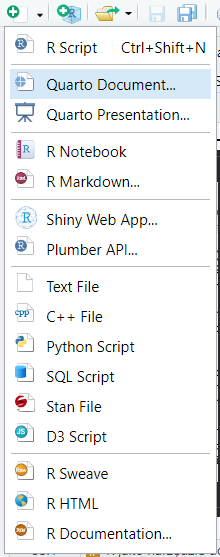
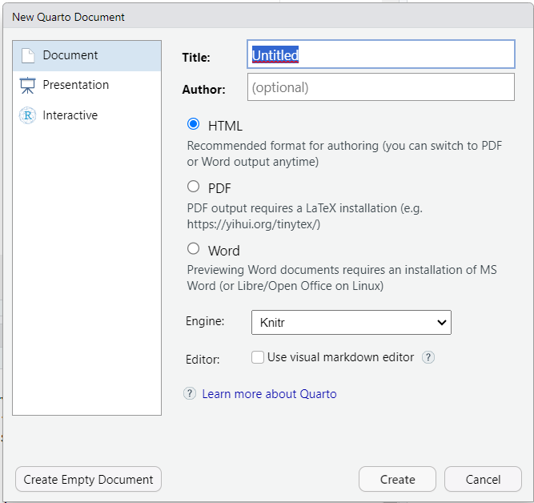
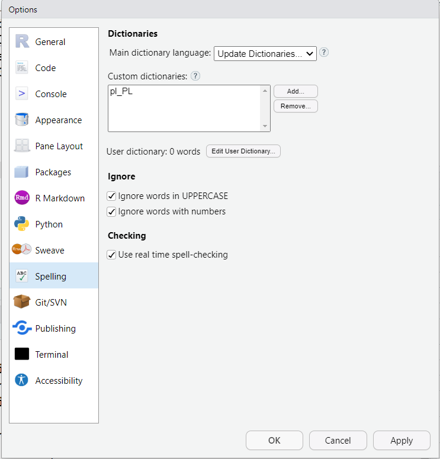

```{r include=FALSE}
library(tidyverse)
library(countdown)
```

# Zbiór danych - [pracownicy](http://www.wawrowski.edu.pl/data/pracownicy.xlsx)

- id - kod pracownika
- plec - płeć pracownika (0 - mężczyzna, 1 - kobieta)
- data_urodz - data urodzenia
- edukacja - wykształcenie (w latach nauki)
- kat_pracownika - grupa pracownicza (1 - specjalista, 2 - menedżer, 3 - konsultant)
- bwynagrodzenie - bieżące wynagrodzenie
- pwynagrodzenie - początkowe wynagrodzenie
- staz - staż pracy (w miesiącach)
- doswiadczenie - poprzednie zatrudnienie (w miesiącach)
- zwiazki - przynależność do związków zawodowych (0 - nie, 1 - tak)
- wiek - wiek (w latach)

---

# R jako narzędzie do raportowania

Połączenie języka R lub Python z językiem znaczników _markdown_ z wykorzystaniem [Quarto](https://quarto.org/) umożliwia tworzenie plików zawierających zarówno kod, jak i tekst oraz wyniki obliczeń, które można eksportować do plików:

- html,

- docx,

- pdf (potrzebny [MiKTeX](https://miktex.org/) albo [TinyTeX](https://yihui.org/tinytex/)).

Pliki źródłowe mają zawsze rozszerzenie .qmd.

--

Poprzednikiem Quarto był R Markdown, który działa na bardzo podobnej zasadzie.

---

# Nowy dokument

.pull-left[



]

.pull-right[



]

---

# Preambuła

.pull-left[

__Podstawowa__

```
---
title: "Pierwszy raport"
---

```

__Rozszerzona__

```
---
title: "Pierwszy raport"
author: "Łukasz"
format: html
lang: pl
self-contained: true
toc: true
---
```

]

.pull-right[

- pole `format` może przyjmować [różne wartości](https://quarto.org/docs/output-formats/all-formats.html):
  - html
  - pdf
  - docx
  - odt
  - epub
  
- pliki html możemy publikować na [wiele różnych sposobów](https://quarto.org/docs/publishing/quarto-pub.html)

- pole `self-contained` z wartością `true` tworzy tylko jeden plik wynikowy, co ułatwia dystrybucję np. przez wiadomość e-mail

- pole `toc` z wartością `true` dodaje spis treści
  
]

---

# Markdown - tekst

Raport zwykle zawiera opisy, które można formatować w następujący sposób:

.pull-left[
__Kod__
```
To jest zwykły tekst.
_Kursywa_ i __pogrubienie__.
Enter nie wystarczy, żeby przejść  
do nowej linii - trzeba wstawić  
co najmniej __dwie spacje__.
```
]
.pull-right[
__Wynik__   
  
To jest zwykły tekst.  
_Kursywa_ i __pogrubienie__.  
Enter nie wystarczy, żeby przejść  
do nowej linii - trzeba wstawić  
co najmniej __dwie spacje__.
]

---

# Nagłówki

Struktura dokumentu definiowa jest przez nagłówki.

__Kod__
```
# Nagłówek pierwszego stopnia
## Nagłówek drugiego stopnia
### Nagłówek trzeciego stopnia
```

__Wynik__   
   
# Nagłówek pierwszego stopnia
## Nagłówek drugiego stopnia
### Nagłówek trzeciego stopnia

---
# Listy

.pull-left[
__Kod__
```
1. Pozycja 1
1. Pozycja 2
1. Pozycja 3
    - Pozycja 3a
    - Pozycja 3b
```
]
.pull-right[
__Wynik__   
   
1. Pozycja 1
2. Pozycja 2
3. Pozycja 3
    - Pozycja 3a
    - Pozycja 3b

]

---

# Linki

Adresy stron internetowych automatycznie zamieniają się na linki. Można też stworzyć tekst, który będzie prowadził do strony.

__Kod__
```
https://cdv.pl/

[Collegium Da Vinci](https://cdv.pl/)
```

__Wynik__   
   
https://cdv.pl/

[Collegium Da Vinci](https://cdv.pl/)

---

# Tabela

.pull-left[
__Kod__
```
| abc | def | ghi |
|-----|----:|:---:|
|  1  |  2  |  3  |
|  4  |  5  |  6  |
|  7  |  8  |  9  |

```
]
.pull-right[
__Wynik__   
   
| abc | def | ghi |
|-----|----:|:---:|
|  1  |  2  |  3  |
|  4  |  5  |  6  |
|  7  |  8  |  9  |

]

- [generator tabel](https://tablesgenerator.com/markdown_tables)

---

# Wzory

- składnia LaTeX

.pull-left[
__Kod__
```
$\frac{1}{2} \cdot \sqrt{4}=1$


$$\sigma \sim N(0,1)$$

```
]
.pull-right[
__Wynik__   
   
$\frac{1}{2} \cdot \sqrt{4}=1$

$$\sigma \sim N(0,1)$$

]


---

# LaTeX

Oprogramowanie do zautomatyzowanego składu tekstu, a także związany z nim język znaczników, służący do formatowania dokumentów tekstowych i tekstowo-graficznych.

- praca lokalnie na komputerze wymaga zainstalowania programu [MikTeX](https://miktex.org/) oraz edytora składni: TeXworks (domyślny), [TeXstudio](https://www.texstudio.org/), [TeXnicCenter](http://www.texniccenter.org/).

- edytor online: [overleaf](https://www.overleaf.com/) - podpowiadanie składni, dostęp przez przeglądarkę, dzielenie się projektami, dużo samouczków

- [Książka kucharska LaTeX](http://www.ptm.org.pl/sites/default/files/latex-ksiazka-kucharska.pdf)

---

# Kod R

- wstawienie chunka (kawałek, klocek, blok): `ctrl + alt + i` (jak insert)

- wyniki pojawiają się poniżej chunka, a nie w konsoli lub dedykowanych zakładkach

- trzeba pamiętać o spójności kodu, ponieważ w trakcie generowania dokumentu kod jest po kolei wykonywany

- zaczyna się i kończy trzema [grawisami](https://pl.wikipedia.org/wiki/Grawis) (znak po lewej stronie klawisza 1 na klawiaturze)

---

# Opcje _chunka_

Opcje można ustawiać globalnie (dla całego dokumentu) lub lokalnie (dla konkretnego chunka).

- eval - wykonaj kod w chunku: domyślnie `true`, wartość `false` jedynie wyświetla kod
- echo - wyświetl kod źródłowy w dokumencie 
- output - wyświetl wynik działania kodu w dokumencie 
- warning - wyświetl ostrzeżenia i komunikaty w dokumencie
- error - zatrzymaj tworzenie dokumentu w przypadku wystąpienia błędu
- fig-height - wysokość rysunku (w calach)
- fig-width - szerokość rysunku (w calach)

[Żródło](https://quarto.org/docs/reference/formats/html.html)

---

# Opcje _chunka_

.pull-left[

Ustawienia lokalne

```
#| echo: false
#| fig-height: 4
```
]
.pull-right[

Ustawienia globalne

```
---
execute:
  echo: false
  warning: false
---
```

]

---

# Odnośniki i tytuły

Quarto umożliwia także dodawanie odnośników do tabel, rysunków, kodu, sekcji i wzorów.

.pull-left[

__Tabela__

- Stworzenie etykiety w chunku

```
#| label: tbl-iris
#| tbl-cap: "6 obserwacji ze zbioru irysy"
```

- Odwołanie się w tekście

@tbl-iris przedstawia dane ze zbioru irysy.

]
.pull-right[

__Rysunek__

- Stworzenie etykiety w chunku

```
#| label: fig-sepal-len-width
#| fig-cap: "Wykres"
```

- Odwołanie się w tekście

Na wykresie [-@fig-sepal-len-width] przedstawiono...

]

Należy pamiętać o odpowiednich przedrostkach, więcej informacji na temat odnośników znajduje się na stronie [quarto](https://quarto.org/docs/authoring/cross-references.html).

---

# Tabele ze zbioru

Funkcja `kable()` z pakietu _knitr_ przekazuje zbiór do formatu html.

```{r}
iris %>% 
  head() %>% # pierwsze 6 obserwacji ze zbioru
  knitr::kable()
```

---

# Tabele ze zbioru

Dodanie następującej opcji do preambuły:

```
format: 
  html: 
    df-print: paged
```

umożliwia stworzenie przeglądarki do większych zbiorów danych. Wówczas w chunku wystarczy wpisać nazwę zbioru dla którego chcemy stworzyć taki element.

---

# Wyniki kodu w tekście

W zwykłym tekście poza chunkiem można wstawiać wyniki obliczone przez R wstawiając grawisy, literę `r` oraz kod, który ma wyświetlić pożądany wynik.

.pull-left[
__Kod__  
Średnia długość płatków irysów wynosi

&#x60; r round(mean(iris$Petal.Length),2) &#x02CB;

centymetry.
]

.pull-right[
__Wynik__

Średnia długość płatków irysów wynosi `r round(mean(iris$Petal.Length),2)` centymetry.

]

---

# Polski słownik

.pull-left[

RStudio będzie sugerował błędy w słowach w języku polskim poprzez czerwone podkreślenie. W celu poprawy komfortu pracy można dodać słownik języka polskiego. Z repozytorium [LibreOffice](https://github.com/LibreOffice/dictionaries/tree/master/pl_PL) pobieramy plik [pl_PL.dic](https://raw.githubusercontent.com/LibreOffice/dictionaries/master/pl_PL/pl_PL.dic) i dodajemy go do programu: Tools -> Global options -> Spelling

]

.pull-right[



]

---

class: inverse

# Zadanie

1. Dodaj do dokumentu dowolny wykres stworzony na podstawie zbioru _pracownicy_. Nie wyświetlaj kodu tego wykresu.

2. W raporcie umieść zdanie _Średni wiek pracowników wynosi X lat_, gdzie X to wartość obliczona na podstawie zbioru danych.

3. Umieść w raporcie tabelę zawierającą średnie wynagrodzenia (początkowe i bieżące) w grupach kategorii pracownika.

`r countdown(minutes = 10, seconds = 0, top = 0)`

---

class: inverse, center, middle

# Pytania?