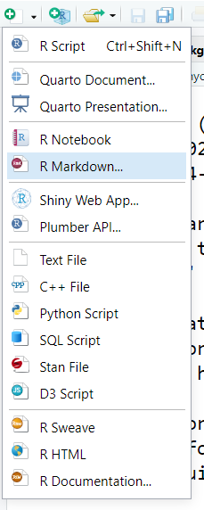
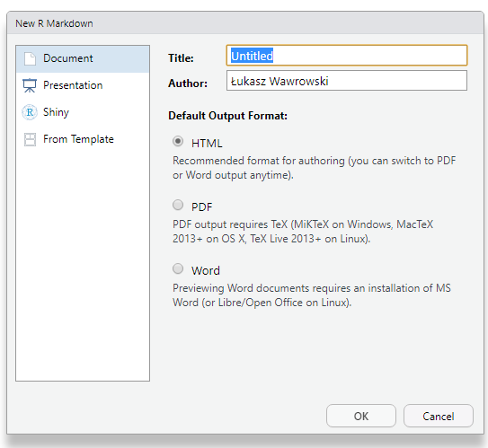
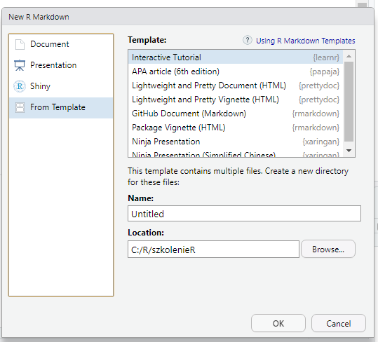
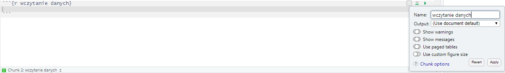

```{r include=FALSE}
library(tidyverse)
library(countdown)
```

# Zbiór danych - [pracownicy](http://www.wawrowski.edu.pl/data/pracownicy.xlsx)

- id - kod pracownika
- plec - płeć pracownika (0 - mężczyzna, 1 - kobieta)
- data_urodz - data urodzenia
- edukacja - wykształcenie (w latach nauki)
- kat_pracownika - grupa pracownicza (1 - specjalista, 2 - menedżer, 3 - konsultant)
- bwynagrodzenie - bieżące wynagrodzenie
- pwynagrodzenie - początkowe wynagrodzenie
- staz - staż pracy (w miesiącach)
- doswiadczenie - poprzednie zatrudnienie (w miesiącach)
- zwiazki - przynależność do związków zawodowych (0 - nie, 1 - tak)
- wiek - wiek (w latach)

---

# R jako narzędzie do raportowania

Połączenie języka __R__ i __markdown__ umożliwia tworzenie dynamicznych raportów, które można eksportować do plików:

- html,

- docx,

- pdf (potrzebny [MiKTeX](https://miktex.org/)).

Pliki źródłowe mają zawsze rozszerzenie .Rmd.

---

# Nowy dokument

.pull-left[



]

.pull-right[



]


---

# Template

.pull-left[



]

.pull-right[

- pakiety rozszerzają funkcjonalność:

  - prezentacje (pakiet [xaringan](https://bookdown.org/yihui/rmarkdown/xaringan.html))
  
  - strony internetowe (pakiety [prettydoc](https://prettydoc.statr.me/), [distill](https://rstudio.github.io/distill/))
  
  - artykuły naukowe (pakiet [papaja](https://crsh.github.io/papaja_man/))

]


---

# Preambuła

.pull-left[

```markdown
---
title: "Tytuł"
author: "Imię i nazwisko"
date: "25 09 2019"
output: word_document
---

```


]

.pull-right[

- w polu _title_, _author_ i _date_ może się znaleźć dowolny tekst

- pole _output_ przyjmuje trzy wartości:

  - html_document
  
  - pdf_document
  
  - word_document
  
- html może być opublikowany na stronie https://rpubs.com/
  
]


---

# Markdown - tekst

Większość raportu będzie stanowił zwykły tekst.

.pull-left[
__Kod__
```
To jest zwykły tekst.
_Kursywa_ i __pogrubienie__.
Enter nie wystarczy, żeby przejść  
do nowej linii - trzeba wstawić  
co najmniej __dwie spacje__.
```
]
.pull-right[
__Wynik__   
  
To jest zwykły tekst.  
_Kursywa_ i __pogrubienie__.  
Enter nie wystarczy, żeby przejść  
do nowej linii - trzeba wstawić  
co najmniej __dwie spacje__.
]

---

# Nagłówki

Struktura dokumentu definiowa jest przez nagłówki.

__Kod__
```
# Nagłówek pierwszego stopnia
## Nagłówek drugiego stopnia
### Nagłówek trzeciego stopnia
```

__Wynik__   
   
# Nagłówek pierwszego stopnia
## Nagłówek drugiego stopnia
### Nagłówek trzeciego stopnia

---
# Listy

.pull-left[
__Kod__
```
1. Pozycja 1
2. Pozycja 2
3. Pozycja 3
    - Pozycja 3a
    - Pozycja 3b
```
]
.pull-right[
__Wynik__   
   
1. Pozycja 1
2. Pozycja 2
3. Pozycja 3
    - Pozycja 3a
    - Pozycja 3b

]

---

# Linki

Adresy stron internetowych automatycznie zamieniają się na linki. Można też stworzyć tekst, który będzie prowadził do strony.

__Kod__
```
https://cdv.pl/

[Collegium Da Vinci](https://cdv.pl/)
```

__Wynik__   
   
https://cdv.pl/

[Collegium Da Vinci](https://cdv.pl/)

---

# Tabela

.pull-left[
__Kod__
```
| abc | def | ghi |
|-----|----:|:---:|
|  1  |  2  |  3  |
|  4  |  5  |  6  |
|  7  |  8  |  9  |

```
]
.pull-right[
__Wynik__   
   
| abc | def | ghi |
|-----|----:|:---:|
|  1  |  2  |  3  |
|  4  |  5  |  6  |
|  7  |  8  |  9  |

]

- [generator tabel](https://tablesgenerator.com/markdown_tables)

---

# Wzory

- składnia LaTeX

.pull-left[
__Kod__
```
$\frac{1}{2} \cdot \sqrt{4}=1$


$$\sigma \sim N(0,1)$$

```
]
.pull-right[
__Wynik__   
   
$\frac{1}{2} \cdot \sqrt{4}=1$

$$\sigma \sim N(0,1)$$

]


---

# LaTeX

Oprogramowanie do zautomatyzowanego składu tekstu, a także związany z nim język znaczników, służący do formatowania dokumentów tekstowych i tekstowo-graficznych.

- praca lokalnie na komputerze wymaga zainstalowania programu [MikTeX](https://miktex.org/) oraz edytora składni: TeXworks (domyślny), [TeXstudio](https://www.texstudio.org/), [TeXnicCenter](http://www.texniccenter.org/).

- edytor online: [overleaf](https://www.overleaf.com/) - podpowiadanie składni, dostęp przez przeglądarkę, dzielenie się projektami, dużo samouczków

- [Książka kucharska LaTeX](http://www.ptm.org.pl/sites/default/files/latex-ksiazka-kucharska.pdf)

---

# Kod R

- ctrl + alt + i

- wyniki pojawiają się poniżej chunka, a nie w konsoli lub dedykowanych zakładkach

- trzeba pamiętać o spójności kodu, ponieważ w trakcie generowania dokumentu kod jest po kolei wykonywany

- zaczyna się i kończy trzema [grawisami](https://pl.wikipedia.org/wiki/Grawis) (znak po lewej stronie klawisza 1 na klawiaturze)

---

# Opcje _chunka_



- echo - wyświetl kod w dokumencie (domyślnie `TRUE`)
- error - wyświetl błędy w dokumencie (`TRUE`) lub zatrzymaj wykonywanie w przypadku błędu (`FALSE` - domyślnie)
- eval - wykonaj kod w chunku (domyślnie `TRUE`)
- message - wyświetl wiadomości w dokumencie (domyślnie `TRUE`)
- warning - wyświetl ostrzeżenia w dokumencie (domyślnie `TRUE`)
- include - uwzględnij kod w dokumencie (domyślnie `TRUE`)
- fig.height - wysokość rysunku (w calach)
- fig.width - szerokość rysunku (w calach)

[źródło](https://bookdown.org/yihui/rmarkdown/)

---

# Tabele ze zbioru

Funkcja `kable()` z pakietu _knitr_ przekazuje zbiór do formy tabelarycznej.

```{r}
iris %>% 
  head() %>% # piersze 6 obserwacji ze zbioru
  knitr::kable()
```


---

# Wyniki kodu w tekście

W zwykłym tekście poza chunkiem można wstawiać wyniki obliczone przez R wstawiając grawisy, literę `r` oraz kod, który ma wyświetlić pożądany wynik.

.pull-left[
__Kod__  
Średnia długość płatków irysów wynosi

&#x60; r round(mean(iris$Petal.Length),2) &#x02CB;

centymetry.
]

.pull-right[
__Wynik__

Średnia długość płatków irysów wynosi `r round(mean(iris$Petal.Length),2)` centymetry.

]

---

class: inverse

# Zadanie

1. Dodaj do dokumentu dowolny wykres stworzony na podstawie zbioru _pracownicy_. Nie wyświetlaj kodu tego wykresu.

2. W raporcie umieść zdanie _Średni wiek pracowników wynosi X lat_, gdzie X to wartość obliczona na podstawie zbioru danych.

3. Umieść w raporcie tabelę zawierającą średnie wynagrodzenia (początkowe i bieżące) w grupach kategorii pracownika.

`r countdown(minutes = 10, seconds = 0, top = 0)`

---

class: inverse, center, middle

# Pytania?