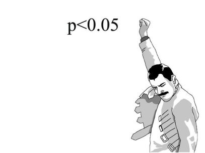
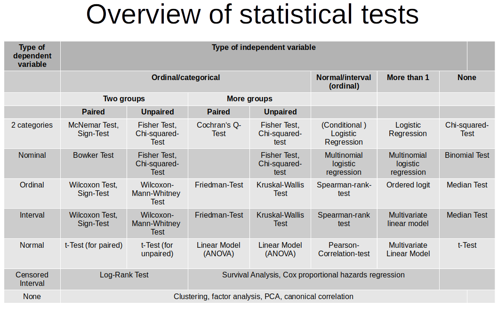

```{r include=FALSE}
library(tidyverse)
library(countdown)
```

# Testowanie hipotez

1. Sformułowanie dwóch wykluczających się hipotez - zerowej $H_0$ oraz alternatywnej $H_1$

2. Wybór odpowiedniego testu statystycznego

3. Określenie dopuszczalnego prawdopodobieństwo popełnienia błędu I rodzaju (czyli poziomu istotności $\alpha$) 

4. Podjęcie decyzji

---

# Wartość p

.pull-left[

- najostrzejszy poziom istotności, przy którym możemy odrzucić hipotezę $H_0$

- podjęcie decyzji na podstawie porównania wartości p z poziomem istotności $\alpha$

- $p < \alpha$ - odrzucamy hipotezę zerową

- [Rozważania o p-value](http://cejsh.icm.edu.pl/cejsh/element/bwmeta1.element.cejsh-e3daa053-7cf2-4eee-9192-16c48c3a7a45/c/05.pdf)

- [Oświadczenie Amerykańskiego Towarzystwa statystycznego o stosowaniu wartości p](https://idane.pl/post/oswiadczenie-amerykanskiego-towarzystwa-statystycznego-o-stosowaniu-wartosci-p-i-co-z-tego-wynika/)

]

.pull-right[



]

---

# Testy statystyczne


---

# Testy statystyczne

|                       | Skala nominalna - nieparametryczne | Skala porządkowa - nieparametryczne                  | Skala ilorazowa - parametryczne             |
|-----------------------|------------------------------------|------------------------------------------------------|---------------------------------------------|
| Jedna próba           | Test zgodności $\chi^2$ - `prop.test()`     | Test zgodności Shapiro-Wilka - `shapiro.test()`, Test Wilcoxona - `wilcox.test()` | Test t - `t.test()`                   |
| Dwie próby niezależne | Test niezależności $\chi^2$ - `chisq.test()`, Test zgodności $\chi^2$ - `prop.test()` | Test Flignera-Killeena - `fligner.test()`, Test Manna-Whitneya - `wilcox.test()` | Test F - `var.test()`, Test t - `t.test()`                |
| Dwie próby zależne    | Test McNemara - `mcnemar.test()`     | Test Wilcoxona - `wilcox.test()`  | Test t - `t.test()`    |
| K prób niezależnych   | Test zgodności $\chi^2$ - `chisq.test()` | Test Flignera-Killeena - `fligner.test()`, Test Kruskala-Wallisa - `kruskal.test()` | Test Bartletta - `bartlett.test()`, ANOVA - `aov()` |

---

<center></center>

[źródło](https://philipppro.github.io/Statistical_tests_overview/)

---

# Test niezależności $\chi^2$

Za pomocą testu niezależności $\chi^2$ można sprawdzić czy pomiędzy dwiema cechami jakościowymi występuje zależność.

- $H_0:$ zmienne są niezależne,

- $H_1:$ zmienne nie są niezależne.

Funkcja `chisq.test()` z pakietu _stats_:

- tabela kontyngencji utworzona za pomocą funkcji `table()`

---

class: inverse

# Zadanie

Czy pomiędzy płcią, a grupami bieżącego wynagrodzenia zdefiniowanymi przez medianę istnieje zależność?

`r countdown(minutes = 5, seconds = 0, top = 0)`

---

# Test proporcji

Test proporcji pozwala odpowiedzieć na pytanie czy odsetki w jednej, dwóch lub więcej grupach różnią się od siebie istotnie.

- $H_0: p_1=p_2$

- $H_1: p_1 \neq p_2$ lub $H_1: p_1 > p_2$ lub $H_1: p_1 < p_2$

Funkcja `prop.test` z pakietu _stats_:

- `x` - licznik badanych odsetków

- `n` - mianownik badanych odsetków

---

# Przykład

Wysunięto przypuszczenie, że palacze papierosów stanowią jednakowy odsetek wśród mężczyzn i kobiet. W celu sprawdzenia tej hipotezy wylosowano 500 mężczyn i 600 kobiet. Okazało się, że wśród mężczyzn było 200 palaczy, a wśród kobiet 250.

--

```{r}
prop.test(x = c(200,250), n = c(500,600))
```

---

class: inverse

# Zadanie

W pewnym powiecie na 119 przedsiębiorstw z sekcji PKD C i 174 z sekcji F w badaniu DG 1 wzięło odpowiednio 14 i 24 przedsiębiorstwa. Na poziomie istotności 0,05 zweryfikuj hipotezę, że odsetek przedsiębiorstw biorących udział w badaniu różni się pomiędzy sekcjami PKD. 

`r countdown(minutes = 5, seconds = 0, top = 0)`

---

# Test normalności

Najpopularniejszym testem jest test Shapiro-Wilka:

- $H_0: F(x) = F_0(x)$ - rozkład cechy ma rozkład normalny

- $H_1: F(x) \neq F_0(x)$ - rozkład cechy nie ma rozkładu normalnego

Funkcja `shapiro.test()` z pakietu _stats_:

- `x` - badana cecha

Maksymalna liczba obserwacji to 5000. Dla większej liczby test Kołmogorova-Smirnova (`ks.test()`) porównujący dwa rozkłady.

---

# Wykres kwantyl-kwantyl

.pull-left[

```{r eval=FALSE}
set.seed(128)

df <- data.frame(norm = rnorm(50))

ggplot(df, aes(sample = norm)) +
  stat_qq() + 
  stat_qq_line() 

```

]

.pull-right[

```{r echo=FALSE}
set.seed(128)

df <- data.frame(norm = rnorm(50))

ggplot(df, aes(sample = norm)) +
  stat_qq() + 
  stat_qq_line() 

```

]

---

class: inverse

# Zadanie

Czy cecha _bieżące wynagrodzenie_ ma rozkład normalny? Sprawdź za pomocą odpowiedniego testu oraz wykresu kwantyl-kwantyl.

`r countdown(minutes = 5, seconds = 0, top = 0)`

---

# Generowanie wartości

- losowanie wartości z rozkładu:

  - jednostajnego - funkcja `runif()`
  
  - normalnego - funkcja `rnorm()`
  
  - [inne rozkłady](https://stat.ethz.ch/R-manual/R-devel/library/stats/html/Distributions.html)
  
--
  
ziarno generatora: `set.seed()`

---

# Test wariancji

Jeśli chcemy sprawdzić homogeniczność wariancji w więcej niż dwóch grupach to należy skorzystać z testu Bartletta:

- $H_0: s^2_1=s^2_2= s^2_3 =...=s^2_k$

- $H_1: \exists_{i,j\in\{1,..,k\}} \; s^2_i \neq s^2_j$

Funkcja `bartlett.test()` z pakietu _stats_:

- jako wzór z tyldą `zmienna_analizowana ~ zmienna_grupująca`.

---

# Próby zależne i niezależne

**Próby zależne (paired)**

Analizowane są te same jednostki, ale różne cechy.

**Próby niezależne (unpaired)**

Analizowane są różne jednostki, ale ta sama cecha.

---

# Test t-średnich

Porównanie wartości średnich:

- $H_0: m_1 = m_2$

- $H_1: m_1 \neq m_2$ lub $H_1: m_1 < m_2$ lub $H_1: m_1 > m_2$

Funkcja `t.test()`

- jako wzór z tyldą `zmienna_analizowana ~ zmienna_grupująca`

- `data` - zbiór danych

- `paired = TRUE` - dodatkowy argument dla prób zależnych

---

# Test Wilcoxona

Test Wilcoxona jest nieparametryczną wersją testu t.

- $H_0: F_1=F_2$

- $H_1: F_1 \neq F_2$

Funkcja `wilcox.test()` - argumenty takie jak w przypadku funkcji `t.test()`.

---

class: inverse

# Zadanie 

Sprawdź czy wynagrodzenie różni się w zależności od płci.

`r countdown(minutes = 5, seconds = 0, top = 0)`

---

# ANOVA

W przypadku większej liczby grup stosuje się jednoczynnikową analizę wariancji (ANOVA).

- $H_0: m_1 = m_2 = m_3 = ... = m_k$

- $H_1: \exists_{i,j\in\{1,..,k\}} \; m_i \neq m_j$

Funkcja `aov()`.

- wzór z tyldą `zmienna_analizowana ~ zmienna_grupująca`

- `data` - zbiór danych

Funkcja `TukeyHSD()` przeprowadza test post-hoc w przypadku istotnych różnic.

---

# Test Kruskala-Wallisa

Test Kruskala-Wallisa jest nieparametrycznym odpowiednikiem ANOVA.

- $H_0: F_1=F_2=F_3=...=F_k$

- $H_1: \exists_{i,j\in\{1,..,k\}} \; F_i \neq F_j$

Funkcja `kruskal.test()` - argumenty takie jak w przypadku funkcji `aov()`.

---

class: inverse

# Zadanie 

Sprawdź czy wynagrodzenie różni się w zależności od kategorii pracownika.

`r countdown(minutes = 5, seconds = 0, top = 0)`

---

class: inverse, center, middle

# Pytania?