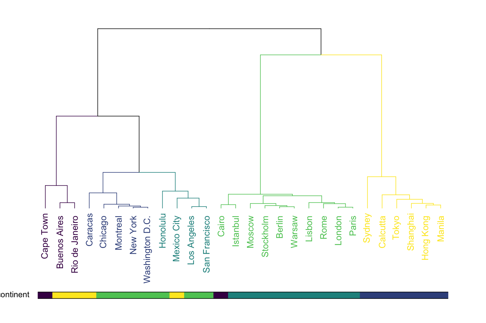

```{r include=FALSE}
library(tidyverse)
library(countdown)

knitr::opts_chunk$set(message = FALSE, warning = FALSE, fig.width = 12, fig.height = 6)
```

# Podział metod

Uczenie nadzorowane - końcowy wynik jest znany

- regresja

- klasyfikacja

Uczenie nienadzorowane - końcowy wynik nie jest znany

- grupowanie obiektów

- grupowanie cech

---

# Podział metod


---

# Grupowanie

Metoda iteracyjna:

- funkcja `kmeans()`

- pakiet [_ClusterR_](https://cran.r-project.org/web/packages/ClusterR/index.html)

Metoda hierarchiczna:

- funkcja `hclust()`

- pakiet [_ggdendro_](https://cran.r-project.org/web/packages/ggdendro/index.html)

- pakiet [_clusterCrit_](https://cran.r-project.org/web/packages/clusterCrit/)

---

# Idea

Liczenie odległości pomiędzy analizowanymi obiektami.

Cechy opisujące obiekty mogą być wyrażone w różnych jednostkach np. w segmentacji klientów:

- wiek w latach

- wydatki na zakupy

- liczba wizyt w sklepie

W związku z tym konieczna jest **normalizacja** cech czyli pozbawienie ich mian.

Najpopularniejszą metodą normalizacji jest standaryzacja:

$z=\frac{x-\bar{x}}{s}$

gdzie: $\bar{x}$ - średnia, $s$ - odchylenie standardowe.

---

# Standaryzacja

```{r echo=FALSE}
library(patchwork)

sklep77 <- read_csv2("../data/sklep77.csv") %>% 
  filter(czy_otwarty == "Tak")

p1 <- ggplot(sklep77, aes(x=liczba_klientow, y=sprzedaz)) +
  geom_point() +
  xlab("Liczba klientów (w osobach)") +
  ylab("Sprzedaż (w EUR)") +
  ggtitle("Wartości oryginalne") +
  theme_light()

p2 <- sklep77 %>% 
  mutate_at(vars(4:5), scale) %>% 
  ggplot(aes(x=liczba_klientow, y=sprzedaz)) +
  geom_point() +
  xlab("Liczba klientów") +
  ylab("Sprzedaż") +
  ggtitle("Wartości standaryzowane") +
  theme_light()

p1 + p2
```


---

# Metoda k-średnich

1. Wskaż liczbę grup $k$.

2. Wybierz dowolne $k$ punktów jako centra grup.

3. Przypisz każdą z obserwacji do najbliższego centroidu.

4. Oblicz nowe centrum grupy.

5. Przypisz każdą z obserwacji do nowych centroidów. Jeśli któraś obserwacja zmieniła grupę - przejdź do kroku nr 4, a w przeciwnym przypadku zakończ algorytm.

---

# Metoda k-średnich


[źródło](https://dashee87.github.io/data%20science/general/Clustering-with-Scikit-with-GIFs/)

---

# Przykład

Segementacja [klientów sklepu](http://www.wawrowski.edu.pl/adr/data/klienci.csv) w oparciu o następujące dane:

- klientID - identyfikator klienta

- plec - płeć

- wiek - wiek

- roczny_dochod - roczny dochód wyrażony w tys. dolarów

- wskaznik_wydatkow - klasyfikacja sklepu od 1 do 100

---

class: inverse

# Zadanie

1. Dokonaj grupowania danych dotyczących [32 samochodów](http://www.wawrowski.edu.pl/adr/data/auta.csv) według następujących zmiennych: pojemność, przebieg, lata oraz cena.

2. Przeprowadź grupowanie [powiatów na podstawie wybranych wskaźników z 2018 roku](http://www.wawrowski.edu.pl/adr/data/daneGUS.RData).


`r countdown(minutes = 15, seconds = 0, top = 0)`

---

# Metoda hierarchiczna

1. Każda obserwacji stanowi jedną z $N$ pojedynczych grup.

2. Na podstawie macierzy odległości połącz dwie najbliżej leżące obserwacje w jedną grupę.

3. Połącz dwa najbliżej siebie leżące grupy w jedną.

4. Powtórz krok nr 3, aż do uzyskania jednej grupy.

---

# Dendrogram



[źródło](https://www.data-to-viz.com/graph/dendrogram.html)

---

class: inverse

# Zadanie

Do danych z poprzedniego zadania zastosuj metodę hierarchiczną.

`r countdown(minutes = 10, seconds = 0, top = 0)`

---

class: inverse, center, middle

# Pytania?