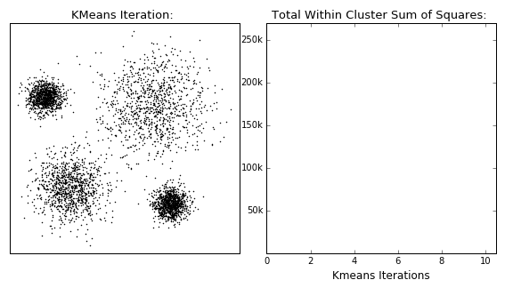

```{r include=FALSE}
library(tidyverse)
library(countdown)

knitr::opts_chunk$set(message = FALSE, warning = FALSE, fig.width = 12, fig.height = 6)
```

# Podział metod

Uczenie nadzorowane - końcowy wynik jest znany

- regresja

- klasyfikacja

Uczenie nienadzorowane - końcowy wynik nie jest znany

- grupowanie obiektów

- grupowanie cech

---

# Podział metod


---

# Grupowanie

Metoda iteracyjna:

- funkcja `kmeans()`

- pakiet [_ClusterR_](https://cran.r-project.org/web/packages/ClusterR/index.html)

Metoda hierarchiczna:

- funkcja `hclust()`

- pakiet [_ggdendro_](https://cran.r-project.org/web/packages/ggdendro/index.html)

- pakiet [_clusterCrit_](https://cran.r-project.org/web/packages/clusterCrit/)

---

# Idea

Liczenie odległości pomiędzy analizowanymi obiektami.

Cechy opisujące obiekty mogą być wyrażone w różnych jednostkach np. w segmentacji klientów:

- wiek w latach

- wydatki na zakupy

- liczba wizyt w sklepie

W związku z tym konieczna jest **normalizacja** cech czyli pozbawienie ich mian.

Najpopularniejszą metodą normalizacji jest standaryzacja:

$z=\frac{x-\bar{x}}{s}$

gdzie: $\bar{x}$ - średnia, $s$ - odchylenie standardowe.

---

# Standaryzacja

```{r echo=FALSE}
library(patchwork)

sklep77 <- read_csv2("../data/sklep77.csv") %>% 
  filter(czy_otwarty == "Tak")

p1 <- ggplot(sklep77, aes(x=liczba_klientow, y=sprzedaz)) +
  geom_point() +
  xlab("Liczba klientów (w osobach)") +
  ylab("Sprzedaż (w EUR)") +
  ggtitle("Wartości oryginalne") +
  theme_light()

p2 <- sklep77 %>% 
  mutate_at(vars(4:5), scale) %>% 
  ggplot(aes(x=liczba_klientow, y=sprzedaz)) +
  geom_point() +
  xlab("Liczba klientów") +
  ylab("Sprzedaż") +
  ggtitle("Wartości standaryzowane") +
  theme_light()

p1 + p2
```


---

# Metoda k-średnich

1. Wskaż liczbę grup $k$.

2. Wybierz dowolne $k$ punktów jako centra grup.

3. Przypisz każdą z obserwacji do najbliższego centroidu.

4. Oblicz nowe centrum grupy.

5. Przypisz każdą z obserwacji do nowych centroidów. Jeśli któraś obserwacja zmieniła grupę - przejdź do kroku nr 4, a w przeciwnym przypadku zakończ algorytm.

---

# Metoda k-średnich



[źródło](https://dashee87.github.io/data%20science/general/Clustering-with-Scikit-with-GIFs/)

---

# Przykład

Segementacja [klientów sklepu](http://www.wawrowski.edu.pl/data/klienci.csv) w oparciu o następujące dane:

- klientID - identyfikator klienta

- plec - płeć

- wiek - wiek

- roczny_dochod - roczny dochód wyrażony w tys. dolarów

- wskaznik_wydatkow - klasyfikacja sklepu od 1 do 100

---

class: inverse

# Zadanie

Dokonaj grupowania danych dotyczących [32 samochodów](http://www.wawrowski.edu.pl/data/auta.csv) według następujących zmiennych: pojemność, przebieg, lata oraz cena.

`r countdown(minutes = 10, seconds = 0, top = 0)`

---

# Metoda hierarchiczna

1. Każda obserwacji stanowi jedną z $N$ pojedynczych grup.

2. Na podstawie macierzy odległości połącz dwie najbliżej leżące obserwacje w jedną grupę.

3. Połącz dwa najbliżej siebie leżące grupy w jedną.

4. Powtórz krok nr 3, aż do uzyskania jednej grupy.

---

# Dendrogram


[źródło](https://www.data-to-viz.com/graph/dendrogram.html)

---

class: inverse

# Zadanie

Do danych z poprzedniego zadania zastosuj metodę hierarchiczną.

`r countdown(minutes = 10, seconds = 0, top = 0)`

---

# Zbiór palmerpenguins

[Zbiór danych na temat pingwinów](https://github.com/allisonhorst/palmerpenguins)


---

# Braki danych

- usunięcie obserwacji z brakami danych

- imputacja statystyczna:

   - metody deterministyczne - zawsze te same wartości imputacyjne:
      
      - zastępowanie wartością przeciętną, imputacja regresyjna,
      - nie wprowadzają dodatkowego źródła błędu losowego,
      - zniekształcają rozkłady zmiennych
   
   - metody stochastyczne - można uzyskać różne wartości imputacyjne:
   
      - metoda hot-deck, stochastyczna imputacja regresyjna,
      - generują dodatkowy błąd,
      - lepiej zachowują rozkłady zmiennych
      
---
      
# Pakiet VIM

[Visualization and Imputation of Missing Values](https://cran.r-project.org/web/packages/VIM/index.html)

[Alexander Kowarik, Matthias Templ (2016). Imputation with the R Package VIM. Journal of Statistical Software, 74(7), 1-16.](https://www.jstatsoft.org/article/view/v074i07/v74i07.pdf)

- implementuje najpopularniejsze metody do zastępowania braków danych,

- funkcje z pakietu zwracają zbiór danych z uzupełnionymi wartościami i flagą dla imputowanych obserwacji

---

# Metoda hot-deck

Dla każdego braku danych poszukiwany jest _dawca_ - obserwacja podobna pod kątem cech skorelowanych ze zmienną (pomocniczych), która zawiera brak danych. 

Warianty:

- losowa - stworzenie grup imputacyjnych na podstawie cech pomocniczcych. Dawca wybierany jest losowo z odpowiedniej grupy.

- sekwencyjna - uporządkowanie danych na podstawie cech pomocniczcych. Dawca wybierany jest jako pierwsza obserwacja o takich samych cechach pomocniczych.

---

# Metoda hot-deck

Funkcja `hotdeck`

```{r eval=FALSE}
hotdeck(data = zbior, variable = "cecha", 
        ord_var = c("zmienna1", "zmienna2"), domain_var = "domena")
```

- `data` - zbiór danych wejściowych

- `variable` - cecha/cechy do imputacji

- `ord_var` - zmienne pomocnicze

- `domain_var` - zmienne domenowe - w ramach, których ma być przeprowadzona imputacja

---

# Metoda najbliższych sąsiadów

Poszukiwanie obserwacji dawcy na podstawie wybranych zmiennych oraz kryterium minimalnej odległości dla wybranej liczby $k$ sąsiadów.

Obliczanie odległości opiera się na metryce Gowera (1971), która umożliwia obliczanie odległości dla cech jakościowych i ilościowych.

Imputowana wartość dla cech ilościowych to mediana z wartości $k$ sąsiadów, a dla cech jakościowych najczęściej występujący wariant.

---

# Metoda najbliższych sąsiadów

Funkcja `kNN`

```{r eval=FALSE}
kNN(data = zbior, variable = c("cecha1", "cecha2"), 
    dist_var = c("zmienna1", "zmienna2", "zmienna3"), k = 5)
```

- `data` - zbiór danych wejściowych

- `variable` - cecha/cechy do imputacji

- `dist_var` - zmienne wykorzystywane do obliczenia odległości

- `k` - liczba sąsiadów

---

# Imputacja regresyjna

Zastąpienie braków danych wartościami teoretycznymi z modelu liniowego.

Funkcja `regressionImp`

```{r eval=FALSE}
regressionImp(formula = model, data = zbior)
```

- `formula` - model dla zmiennej imputowanej

- `data` - zbiór danych wejściowych

Podobnie działa funkcja `rangerImpute()` wykorzystująca lasy losowe, natomiast przy domyślnych parametrach nie będzie metodą deterministyczną.

---

# Paradoks Simpsona

Efekt działania kilku grup wydaje się odwrócony, kiedy grupy są połączone.


--

- Nabór na Uniwersytecie w Berekley w 1951 roku: spośród kandydatów przyjęto 45% mężczyzn i 30% kobiet.

- Uniwersytet został oskarżony o seksizm i sprawa została skierowana do sądu.

---

# Inne algorytmy grupowania

- DBSCAN

- BIRCH

- MeanShift

- GMM

[Skuteczność algorytmów](https://towardsdatascience.com/the-5-clustering-algorithms-data-scientists-need-to-know-a36d136ef68)
---

# Redukcja wymiarów

- [PCA](https://miroslawmamczur.pl/na-czym-polega-analiza-skladowych-glownych-pca/)

- [t-SNE](https://miroslawmamczur.pl/jak-dziala-metoda-redukcji-wymiarow-t-sne/)

- [UMAP](https://cran.r-project.org/web/packages/umap/vignettes/umap.html)

Wiele narzędzi do wizualizacji wyników można znaleźć w pakiecie [factoextra](https://github.com/kassambara/factoextra).

---

class: inverse, center, middle

# Pytania?