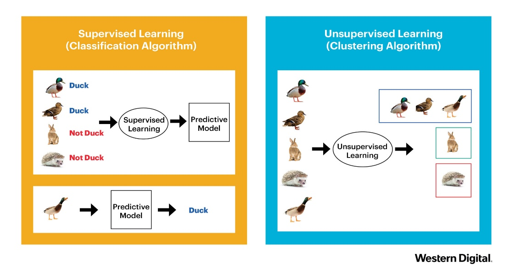

```{r include=FALSE}
library(tidyverse)
library(countdown)

salary <- readxl::read_xlsx("../data/salary.xlsx")

knitr::opts_chunk$set(message = FALSE, warning = FALSE, fig.width = 12, fig.height = 6)
```

# Podział metod

Uczenie nadzorowane - końcowy wynik jest znany

- regresja

- klasyfikacja

Uczenie nienadzorowane - końcowy wynik nie jest znany

- grupowanie obiektów

- grupowanie cech

---

# Podział metod



---

# Grupowanie

Metoda iteracyjna:

- funkcja `kmeans()`

- pakiet [_ClusterR_](https://cran.r-project.org/web/packages/ClusterR/index.html)

Metoda hierarchiczna:

- funkcja `hclust()`

- pakiet [_ggdendro_](https://cran.r-project.org/web/packages/ggdendro/index.html)

- pakiet [_clusterCrit_](https://cran.r-project.org/web/packages/clusterCrit/)

---

# Idea

Liczenie odległości pomiędzy analizowanymi obiektami.

Cechy opisujące obiekty mogą być wyrażone w różnych jednostkach np. w segmentacji klientów:

- wiek w latach

- wydatki na zakupy

- liczba wizyt w sklepie

W związku z tym konieczna jest **normalizacja** cech czyli pozbawienie ich mian.

Najpopularniejszą metodą normalizacji jest standaryzacja:

$z=\frac{x-\bar{x}}{s}$

gdzie: $\bar{x}$ - średnia, $s$ - odchylenie standardowe.

---

# Metoda k-średnich

1. Wskaż liczbę grup $k$.

2. Wybierz dowolne $k$ punktów jako centra grup.

3. Przypisz każdą z obserwacji do najbliższego centroidu.

4. Oblicz nowe centrum grupy.

5. Przypisz każdą z obserwacji do nowych centroidów. Jeśli któraś obserwacja zmieniła grupę - przejdź do kroku nr 4, a w przeciwnym przypadku zakończ algorytm.

---

# Metoda k-średnich

gif

---

# Metoda hierarchiczna

1. Każda obserwacji stanowi jedną z $N$ pojedynczych grup.

2. Na podstawie macierzy odległości połącz dwie najbliżej leżące obserwacje w jedną grupę ($N-1$ grup).

3. Połącz dwa najbliżej siebie leżące grupy w jedną ($N-2$ grup).

4. Powtórz krok nr 3, aż do uzyskania jednej grupy.

---

class: inverse, center, middle

# Pytania?