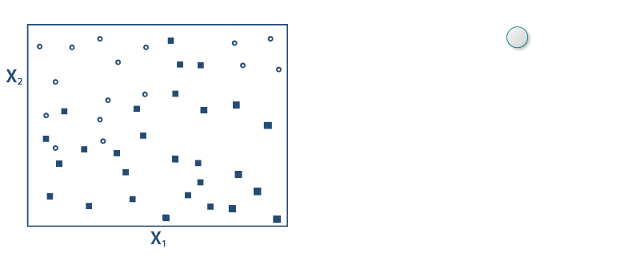
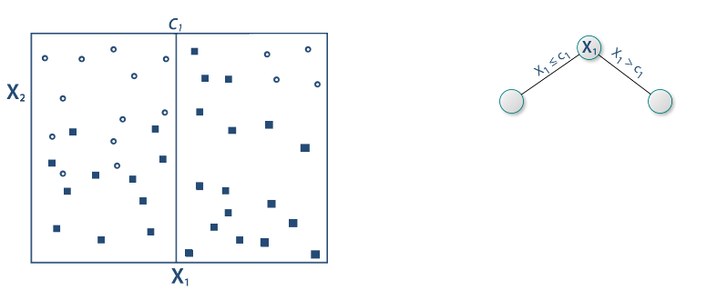
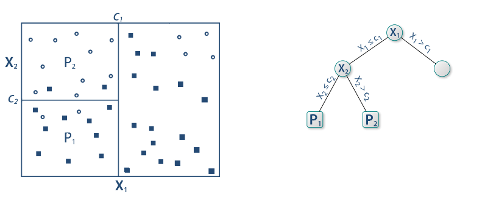
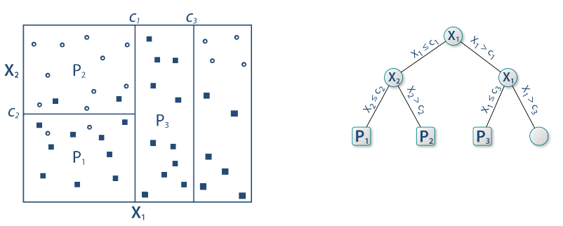
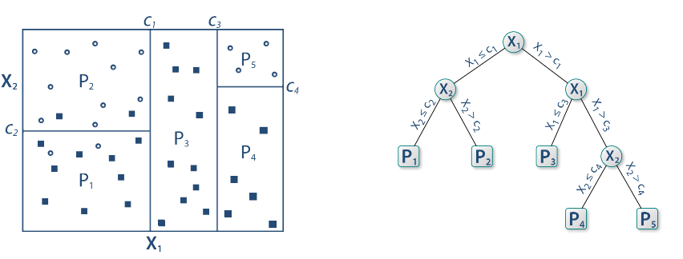
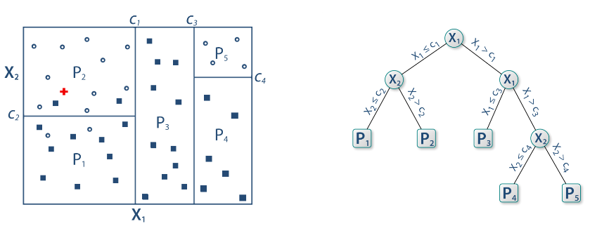
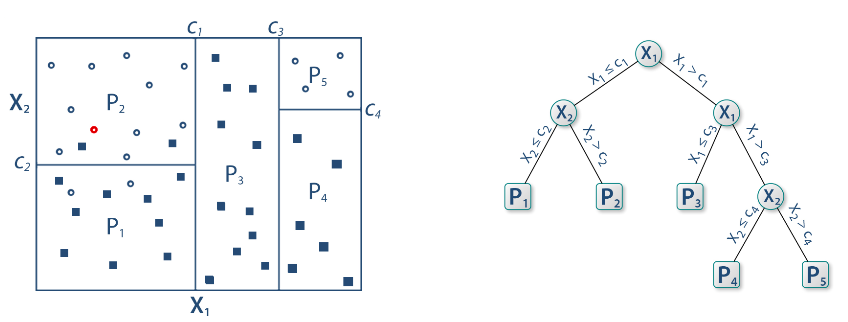
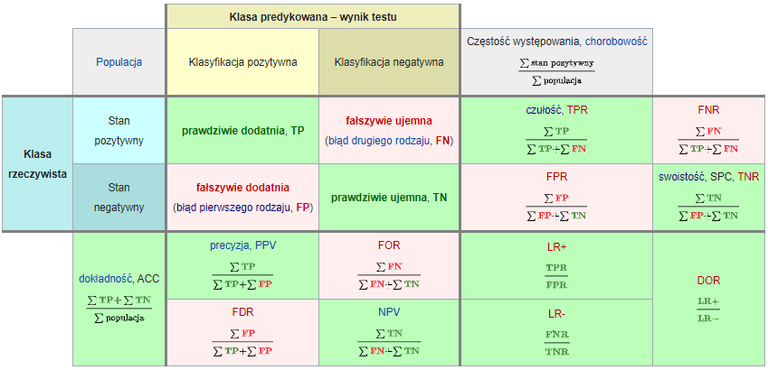
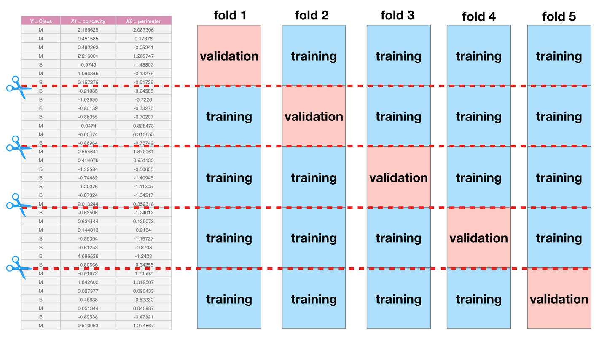

```{r include=FALSE}
library(tidyverse)
library(countdown)

knitr::opts_chunk$set(message = FALSE, warning = FALSE, fig.width = 12, fig.height = 6)
```

# Podział metod

Uczenie nadzorowane - końcowy wynik jest znany

- regresja

- klasyfikacja

Uczenie nienadzorowane - końcowy wynik nie jest znany

- grupowanie obiektów

- grupowanie cech

---

# Podział metod


---

# Klasyfikacja

- binarna (binary) - tylko dwa warianty: zachorowanie, spłata kredytu

- wieloklasowa (multiclass) - typ klienta

- wieloetykietowa (multilabel) - gatunek filmu

---

# Przykład

[German credit data](http://www.wawrowski.edu.pl/data/german_credit_data.xlsx)

1.  Age (numeric)
2.  Sex (text: male, female)
3.  Job (numeric: 0 - unskilled and non-resident, 1 - unskilled and resident, 2 - skilled, 3 - highly skilled)
4.  Housing (text: own, rent, or free)
5.  Saving accounts (text - little, moderate, quite rich, rich)
6.  Checking.account (numeric, in DM - Deutsch Mark)
7.  Credit.amount (numeric, in DM)
8.  Duration (numeric, in month)
9.  Purpose (text: car, furniture/equipment, radio/TV, domestic appliances.. and so on...)
10.  Risk (text: good/bad): it's our Target Variable, describes if client paid or didn't pay loan

---

class: inverse

# Zadanie

W klasyfikacji bardzo ważne jest odpowiednie przygotowanie zbioru danych oraz dobór predyktorów. Proszę utworzyć nową zmienną o nazwie _installment_, która będzie zawierała wysokość raty.

`r countdown(minutes = 5, seconds = 0, top = 0)`

???

Pakiet https://cran.r-project.org/web/packages/vtreat/index.html https://www.youtube.com/watch?v=sniHkkrAsOc

---

# Główne problemy

- braki danych - niektóre algorytmy klasyfikacji nie obsługują braków danych. Usunięcie tych obserwacji spowodowałoby znaczne zmniejszenie próby badawczej, zatem stosuje się metody mające na celu uzupełnienie braków danych. W najprostszym przypadku braki można zastąpić średnią lub dominantą. Do bardziej zaawansowanych należy metoda najbliższych sąsiadów ([VIM](https://cran.r-project.org/web/packages/VIM/index.html)) albo imputacja wielokrotna ([mice](https://cran.r-project.org/web/packages/mice/index.html)).

- dane niezbalansowane - w idealnym przypadku klasyfikacji, przypadków z każdej grupy powinno być tyle samo. W przeciwnym przypadku model będzie dobrze działał wyłącznie dla klasy większościowej. Najprostszą metodą balansowania danych jest upsampling czyli dolosowywanie obserwacji z klasy mniejszościowej, tak aby wyrównać liczebności. Alternatywnie można zastosować metodę SMOTE, która generuje sztuczne obserwacje dla klasy mniejszościowej (pakiety [DMwR](https://cran.r-project.org/web/packages/DMwR/index.html), [imbalance](https://cran.r-project.org/web/packages/imbalance/index.html)). 

---

# Algorytmy

- regresja logistyczna: wymaga spełnienia założeń

- drzewa decyzyjne: łatwo można przeuczyć

- metody nieparametryczne: mało efektywne dla dużych zbiorów

- metody gradientowe: czarna skrzynka

---

# Frameworki do ML

Istnieje wiele pakietów implementujących różne algorytmy ML: 97 w [Machine Learning Task View](https://cran.r-project.org/web/views/MachineLearning.html) (stan na 29.05.2020). Można korzystać z nich pojedyńczo, ale nie są w żadnej sposób wystandaryzowane: różne nazwy argumentów i struktury obiektów wynikowych. 

Pakiety mające na celu integrację różnych algorytmów:

- [caret](https://topepo.github.io/caret/)

- [mlr3](https://mlr3.mlr-org.com/)

- [h2o](https://docs.h2o.ai/h2o/latest-stable/h2o-docs/welcome.html)

---

# Drzewa decyzyjne



[Źródło](https://github.com/WhyR2019/presentations/blob/master/Keynotes/Marvin_Wright_RF.pdf)

---

# Drzewa decyzyjne



---

# Drzewa decyzyjne



---

# Drzewa decyzyjne



---

# Drzewa decyzyjne



---

# Drzewa decyzyjne



---

# Drzewa decyzyjne



---

# Pakiet rpart

Pakiet [rpart](https://cran.r-project.org/web/packages/rpart/index.html) umożliwia tworzenie prostych drzew decyzyjnych. Do wizualizacji tychże najlepiej wykorzystać pakiet [rpart.plot](https://cran.r-project.org/web/packages/rpart.plot/index.html), który tworzy drzewa bardziej atrakcyjne wizualnie.

W przypadku klasyfikacji binarnej każdy węzeł prezentuje:

- prognozowaną klasę

- prawdopodobieństwa zaklasyfikowania do klasy pozytywnej

- odsetek obserwacji w węźle

Pakiet [caret](https://cran.r-project.org/web/packages/caret/index.html) zawiera wiele funkcji przydatnych w klasyfikacji.

---

# Macierz pomyłek (confusion matrix)



[Źródło](https://pl.wikipedia.org/wiki/Tablica_pomy%C5%82ek)

---

# Miary

Wyniki klasyfikacji można oceniać za pomocą wielu miar:

- Dokładność (accuracy): % poprawnie zaklasyfikowanych

- Precyzja (precison): % poprawnie rozpoznanych przypadków pozytywnych TP/(TP+FP)

- Czułość (sensitivity/recall): % prawdziwie pozytywnych TP/(TP+FN)

- Swoistość (specificity): % prawdziwie negatywnych TN/(TN+FP)

- F1: średnia harmoniczna z czułości i precyzji 2TP/(2TP+FP+FN)

---

# Podział zbiorów

Tworzenie modelu na całym zbiorze danych może powodować przetrenowanie algorytmu. Można to porównać do nauki odpowiedzi na pamięć. W celu faktycznej nauki algorytmu dokonuje się podziału zbioru danych na przynajmniej dwa rozłączne zbiory:

- zbiór treningowy (train)

- zbiór walidacyjny (valid)

- zbiór testowy (test) - opcjonalnie

---

# Pakiet h2o

H2O is an open source, in-memory, distributed, fast, and scalable machine learning and predictive analytics platform that allows you to build machine learning models on big data and provides easy productionalization of those models in an enterprise environment.

- wiele algorytmów

- wbudowane metody Explainable AI (XAI) (patrz też: [DrWhy](https://github.com/ModelOriented/DrWhy/blob/master/README.md))

- interfejs graficzny `h2o.flow()`

---

# Walidacja krzyżowa



[Źródło](https://ubc-dsci.github.io/introduction-to-datascience/)

---

# Tuning hiperparametrów

Domyślne parametry modelu nie muszą dawać najlepszych rezultatów. W celu ulepszenia klasyfikatora stosuje się metody przeszukiwania parametrów. 

- learning rate

- max depth

- number of trees

- sample rate

Można przeszukiwać całą przestrzeń paramterów (intensywne obliczeniowo) albo losowo.

---

# Kod w h2o

```r
gbm_params <- list(learn_rate = seq(0.01, 0.1, 0.01),
                    max_depth = seq(2, 10, 1),
                    sample_rate = seq(0.5, 1.0, 0.1),
                    col_sample_rate = seq(0.1, 1.0, 0.1),
                    ntrees = seq(50,150,10))

search_criteria <- list(strategy = "RandomDiscrete", max_models = 36, seed = 1)

gbm_grid <- h2o.grid(algorithm = "gbm", 
                      x = x_var, 
                      y = y_var,
                      grid_id = "gbm_grid1",
                      training_frame = train_data_h2o,
                      validation_frame = test_data_h2o,
                      seed = 1,
                      hyper_params = gbm_params,
                      search_criteria = search_criteria)

gbm_gridperf <- h2o.getGrid(grid_id = "gbm_grid",
                            sort_by = "auc",
                            decreasing = TRUE)

m4 <- h2o.getModel(gbm_gridperf@model_ids[[1]])
```

---

# Symulacja wyniku biznesowego

- średnia kwota kredytu: 3500

- marża na spłaconym kredycie: 20%

- strata na niespłaconym kredycie: 50%

---

# Krzywa ROC

Krzywa ROC to jeden ze sposobów wizualizacji jakości klasyfikacji, pokazujący zależności wskaźników TPR (True Positive Rate) oraz FPR (False Positive Rate).

1. obliczamy prawdopodobieństwo klasyfikacji do danej klasy

2. testujemy wiele progów prawdopodobieństwa (domyślnie 0,5)

3. dla każdego progu obliczamy macierz pomyłek

Pole pod krzywą ROC - AUC (Area under curve) jest jedną z miar jakości klasyfikacji.

[Źródło](https://algolytics.pl/tutorial-jak-ocenic-jakosc-i-poprawnosc-modeli-klasyfikacyjnych-czesc-4-krzywa-roc/)

---

# Objaśnianie modelu

- Ważność cech - jak bardzo model wykorzystuje daną cechę do predycji.

- Partial dependency plots - jak zmienia się prawdopodobieństwo klasyfikacji w zależności od predyktora.

---

class: inverse

# Zadanie

Sprawdź jak model będzie się sprawdzał na danych, w których braki danych są traktowane jako osobna kategoria:

```r
credit_wna <- credit %>% mutate_at(c("saving_accounts", "checking_account"), fct_explicit_na)
```

`r countdown(minutes = 10, seconds = 0, top = 0)`

---

class: inverse

# Zadanie

Przeprowadź [klasyfikację mieszkań](http://www.wawrowski.edu.pl/data/sf_ny_homes.csv) ze względu na miejsce. 

```{r, eval = FALSE}
homes <- read_csv("http://www.wawrowski.edu.pl/data/sf_ny_homes.csv")

homes <- homes %>% 
  mutate(in_sf=as.factor(in_sf))
```

---

class: inverse, center, middle

# Pytania?