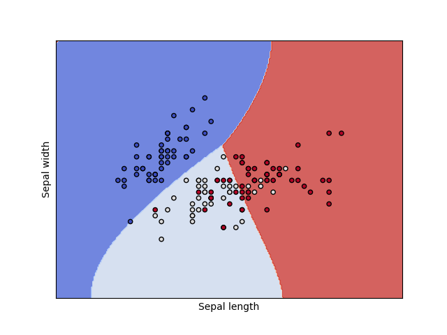

```{r include=FALSE}
library(tidyverse)
library(countdown)

knitr::opts_chunk$set(message = FALSE, warning = FALSE, fig.width = 12, fig.height = 6)
```

# Podział metod

Uczenie nadzorowane - końcowy wynik jest znany

- regresja

- klasyfikacja

Uczenie nienadzorowane - końcowy wynik nie jest znany

- grupowanie obiektów

- grupowanie cech

---

# Podział metod


---

# Klasyfikacja 

- dane tabelaryczne

- obrazy

- teksty

---

# Klasyfikacja

- binarna (binary) - tylko dwa warianty: zachorowanie, spłata kredytu

- wieloklasowa (multiclass) - typ klienta

- wieloetykietowa (multilabel) - gatunek filmu

[A visual introduction to machine learning](http://www.r2d3.us/visual-intro-to-machine-learning-part-1/)

[Model Tuning and the Bias-Variance Tradeoff](http://www.r2d3.us/visual-intro-to-machine-learning-part-2/)

---

# Przykład

[German credit data](http://www.wawrowski.edu.pl/data/german_credit_data.xlsx)

1.  Age (numeric)
2.  Sex (text: male, female)
3.  Job (numeric: 0 - unskilled and non-resident, 1 - unskilled and resident, 2 - skilled, 3 - highly skilled)
4.  Housing (text: own, rent, or free)
5.  Saving accounts (text - little, moderate, quite rich, rich)
6.  Checking account (text, little, moderate, rich)
7.  Credit amount (numeric, in DM)
8.  Duration (numeric, in month)
9.  Purpose (text: car, furniture/equipment, radio/TV, domestic appliances.. and so on...)
10.  Risk (text: good/bad): it's our Target Variable, describes if client paid or didn't pay loan

---

class: inverse

# Zadanie

Proszę utworzyć nową zmienną o nazwie _installment_, która będzie zawierała wysokość raty.

`r countdown(minutes = 5, seconds = 0, top = 0)`

---

# Podział danych

- dane uczące (treningowe) - zbiór przykładów używanych do dopasowania parametrów algorytmu

- dane testowe - niezależny od danych uczących zbiór przykładów o takim samym rozkładzie jak dane uczące

- dane walidacyjne - zbiór przykładów używanych do dopasowania hiperparametrów 

Często nazewnictwo danych testowych i walidacyjnych jest mylone.

[Wikipedia](https://en.wikipedia.org/wiki/Training%2C_validation%2C_and_test_sets)

Pakiet [rsample](https://cran.r-project.org/web/packages/rsample/index.html) zawiera funkcje do podziału zbiorów.

---

# Algorytmy

- drzewa decyzyjne: łatwa interpretacja

- metody nieparametryczne: mało efektywne dla dużych zbiorów

- metody gradientowe: SVM, sieci neuronowe, gradient

---

# Złożoność modelu


---

# Złożoność modelu


---

# Frameworki do ML

Istnieje wiele pakietów implementujących różne algorytmy ML (sprawdź na [Machine Learning Task View](https://cran.r-project.org/web/views/MachineLearning.html)). Można korzystać z nich pojedynczo, ale nie są w żadnej sposób wystandaryzowane: różne nazwy argumentów i struktury obiektów wynikowych. 

Pakiety mające na celu integrację różnych algorytmów:

- [caret](https://topepo.github.io/caret/)

- [mlr3](https://mlr3.mlr-org.com/)

- [h2o](https://docs.h2o.ai/h2o/latest-stable/h2o-docs/welcome.html)

---

# Drzewa decyzyjne


[Źródło](https://github.com/WhyR2019/presentations/blob/master/Keynotes/Marvin_Wright_RF.pdf)

---

# Drzewa decyzyjne


---

# Drzewa decyzyjne


---

# Drzewa decyzyjne


---

# Drzewa decyzyjne


---

# Drzewa decyzyjne


---

# Drzewa decyzyjne


---

# Pakiet rpart

Pakiet [rpart](https://cran.r-project.org/web/packages/rpart/index.html) umożliwia tworzenie prostych drzew decyzyjnych. Do wizualizacji tychże najlepiej wykorzystać pakiet [rpart.plot](https://cran.r-project.org/web/packages/rpart.plot/index.html), który tworzy drzewa bardziej atrakcyjne wizualnie.

W przypadku klasyfikacji binarnej każdy węzeł prezentuje:

- prognozowaną klasę

- prawdopodobieństwa zaklasyfikowania do klasy pozytywnej

- odsetek obserwacji w węźle

Pakiet [caret](https://cran.r-project.org/web/packages/caret/index.html) zawiera wiele funkcji przydatnych w klasyfikacji.

---

# Macierz pomyłek (confusion matrix)


[Źródło](https://pl.wikipedia.org/wiki/Tablica_pomy%C5%82ek)

---

# Miary

Wyniki klasyfikacji można oceniać za pomocą wielu miar:

- Dokładność (accuracy): % poprawnie zaklasyfikowanych

- Precyzja (precison): % poprawnie rozpoznanych przypadków pozytywnych TP/(TP+FP)

- Czułość (sensitivity/recall): % prawdziwie pozytywnych TP/(TP+FN)

- Swoistość (specificity): % prawdziwie negatywnych TN/(TN+FP)

- F1: średnia harmoniczna z czułości i precyzji 2TP/(2TP+FP+FN)

---

# SVM - maszyna wektorów nośnych


---

# SVM - maszyna wektorów nośnych



---

# Lasy losowe

1.  Weź zbiór danych
2.  Wybierz $n$ drzew do zbudowania 
3.  Dla wartości od $i = 1$ do $n$:
4.  |  Wylosuj próbę bootstrapową
5.  |  Stwórz drzewo na podstawie wylosowanych danych
6.  |  Dla każdego podziału
7.  |  | Wylosuj $m$ zmiennych ze wszystkich $p$ zmiennych
8.  |  | Wybierz najlepszą zmienną do podziału
9.  |  | Stwórz podział
10. | Zakończ proces budowy drzewa kiedy kryterium jest optymalne
11. Zwróć zbiór wynikowych drzew

[Źródło](https://bradleyboehmke.github.io/HOML/random-forest.html)

Pakiet [ranger](https://cran.r-project.org/web/packages/ranger/index.html) zawiera szybką implementację lasów losowych.

---

# Boosting gradientowy


---

# Pakiet h2o

H2O is an open source, in-memory, distributed, fast, and scalable machine learning and predictive analytics platform that allows you to build machine learning models on big data and provides easy productionalization of those models in an enterprise environment.

- wiele algorytmów

- wbudowane metody Explainable AI (XAI) (patrz też: [DrWhy](https://github.com/ModelOriented/DrWhy/blob/master/README.md))

- interfejs graficzny `h2o.flow()`

- automatyczny dobór modelu `h2o.automl()` - [webinar](https://www.youtube.com/watch?v=DjzKTeIIxOY&t=2978s)

---

# Walidacja krzyżowa


[Źródło](https://ubc-dsci.github.io/introduction-to-datascience/)

---

# Tuning hiperparametrów

Domyślne parametry modelu nie muszą dawać najlepszych rezultatów. W celu ulepszenia klasyfikatora stosuje się metody przeszukiwania parametrów. 

- learning rate

- max depth

- number of trees

- sample rate

Można przeszukiwać całą przestrzeń parametrów (intensywne obliczeniowo) albo losowo.

---

# Kod w h2o

```r
gbm_params <- list(learn_rate = seq(0.01, 0.1, 0.01),
                    max_depth = seq(2, 10, 1),
                    sample_rate = seq(0.5, 1.0, 0.1),
                    col_sample_rate = seq(0.1, 1.0, 0.1),
                    ntrees = seq(50,150,10))

search_criteria <- list(strategy = "RandomDiscrete", max_models = 36, seed = 1)

gbm_grid <- h2o.grid(algorithm = "gbm", 
                      x = x_var, 
                      y = y_var,
                      grid_id = "gbm_grid1",
                      training_frame = train_data_h2o,
                      validation_frame = test_data_h2o,
                      seed = 1,
                      hyper_params = gbm_params,
                      search_criteria = search_criteria)

gbm_gridperf <- h2o.getGrid(grid_id = "gbm_grid",
                            sort_by = "auc",
                            decreasing = TRUE)

m4 <- h2o.getModel(gbm_gridperf@model_ids[[1]])
```

---

# Symulacja wyniku biznesowego

- średnia kwota kredytu: 3500

- marża na spłaconym kredycie: 20%

- strata na niespłaconym kredycie: 50%

$$\text{wynik}=\text{TP}\cdot(3500\cdot0,2)-\text{FP}\cdot(3500\cdot0,5)$$

---

# Krzywa ROC

Krzywa ROC to jeden ze sposobów wizualizacji jakości klasyfikacji, pokazujący zależności wskaźników TPR (True Positive Rate) oraz FPR (False Positive Rate).

1. obliczamy prawdopodobieństwo klasyfikacji do danej klasy

2. testujemy wiele progów prawdopodobieństwa (domyślnie 0,5)

3. dla każdego progu obliczamy macierz pomyłek

Pole pod krzywą ROC - AUC (Area under curve) jest jedną z miar jakości klasyfikacji. AUC = 1 (klasyfikator idealny), AUC = 0.5 (klasyfikator losowy), AUC < 0.5 (klasyfikator gorszy od losowego).

[Źródło](https://algolytics.pl/tutorial-jak-ocenic-jakosc-i-poprawnosc-modeli-klasyfikacyjnych-czesc-4-krzywa-roc/)

---

# Objaśnianie modelu

- Ważność cech - jak bardzo model wykorzystuje daną cechę do predycji.

- Partial dependency plots - jak zmienia się prawdopodobieństwo klasyfikacji w zależności od predyktora.

[Explanatory Model Analysis](https://pbiecek.github.io/ema/)

[Interpretable Machine Learning](https://christophm.github.io/interpretable-ml-book/)

---

class: inverse

# Zadanie

Przeprowadź [klasyfikację mieszkań](http://www.wawrowski.edu.pl/data/sf_ny_homes.csv) ze względu na miejsce. 

```{r, eval = FALSE}
homes <- read_csv("http://www.wawrowski.edu.pl/data/sf_ny_homes.csv")

homes <- homes %>% 
  mutate(in_sf=as.factor(in_sf))
```

---

class: inverse, center, middle

# Pytania?